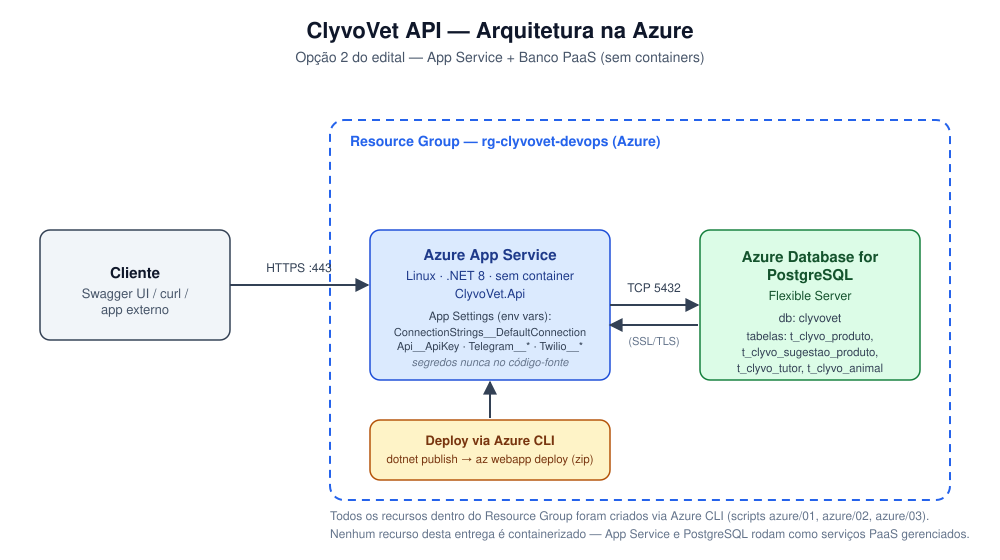

# ClyvoVet API — .NET


## ☁️ Sprint DevOps Tools & Cloud Computing — Deploy na Azure

> Esta seção registra a entrega da disciplina **DevOps Tools & Cloud Computing**: a mesma API (ClyvoVet .NET) apresentada no restante deste README, aqui publicada num **Azure App Service** e ligada a um **Azure Database for MySQL Flexible Server compartilhado com a API Java** do time (Tutor, Animal, Clínica, etc.). O passo a passo a seguir reproduz exatamente o que foi feito no vídeo de entrega.

### Descrição da Solução

Construída em ASP.NET Core 8, a ClyvoVet API gerencia o catálogo de produtos/serviços veterinários e também as sugestões de produto feitas para cada animal, duas tabelas ligadas entre si (`t_clyvo_produto` ← `t_clyvo_sugestao_produto`), ambas com CRUD completo. Para esta entrega, ela roda num **Azure App Service** (Linux, sem container) e grava os dados num **Azure Database for MySQL Flexible Server** — o mesmo banco que a API Java do time usa (Tutor, Animal, Clínica, Veterinário, etc.) —, o que deixa o app Mobile do grupo consumir as duas APIs sobre os mesmos dados.

### Benefícios para o Negócio

- **Catálogo centralizado**: preço, categoria e espécie indicada de cada produto/serviço da clínica passam a viver num só lugar, no lugar de planilhas soltas ou anotações em papel.
- **Sugestão de produto rastreável**: toda sugestão feita a um tutor guarda justificativa e data, o que dá à clínica um histórico de recomendações por animal (ex.: antipulgas sugerido, ração indicada).
- **Integração real entre os sistemas do time**: .NET e Java apontam para o mesmo banco, então um animal já cadastrado na API Java pode receber lembretes e sugestões de produto pela API .NET sem precisar de um segundo cadastro.
- **Escalabilidade sem gerenciar servidor**: por rodar em PaaS (App Service + banco gerenciado), a clínica dispensa infraestrutura própria — disponibilidade, backup e patch do banco ficam por conta da Azure.

### Banco de Dados em Nuvem

- **Motor:** MySQL 8.0, via **Azure Database for MySQL Flexible Server** (nada de H2, nada de container).
- **DDL completo:** [`schema/script_bd.sql`](schema/script_bd.sql) traz o schema inteiro (tabelas da API Java somadas às nossas), com colunas, chaves primárias/estrangeiras, comentários e uma carga inicial de dados relevante. As tabelas `tutor`/`animal`/etc. reproduzem as migrations Flyway reais do repositório da API Java (`clyvovet-backend-java`); mudando o schema de lá, essa cópia precisa acompanhar.
- **Tabelas do CRUD (núcleo da solução, avaliado nesta entrega):** `t_clyvo_produto` e `t_clyvo_sugestao_produto`, ligadas por `produto_id`. Já `tutor` e `animal` são da API Java — entram aqui apenas via FK/JOIN, para leitura, e o .NET nunca escreve nelas.

### Arquitetura escolhida: Opção 2 — App Service + Banco PaaS

Nenhuma parte desta entrega roda em container — nem o app, nem o banco: tudo fica em serviços gerenciados da Azure, provisionados via **Azure CLI**:

| Recurso | Serviço Azure | Criado por |
|---|---|---|
| Grupo de recursos | Resource Group | `azure/01-criar-recursos.sh` |
| Banco de dados | Azure Database for MySQL Flexible Server | `azure/01-criar-recursos.sh` |
| Plano de aplicativo | App Service Plan (Linux, B1) | `azure/02-criar-app-service.sh` |
| Aplicativo web | App Service (.NET 8, runtime nativo, sem container) | `azure/02-criar-app-service.sh` |



### Pré-requisitos

| Ferramenta | Para que serve |
|---|---|
| [Azure CLI](https://learn.microsoft.com/cli/azure/install-azure-cli) | Criar todos os recursos (obrigatório pelo edital) |
| Conta ativa na Azure (`az login`) | Ter uma subscription onde criar os recursos |
| [.NET SDK 8](https://dotnet.microsoft.com/download/dotnet/8.0) | `dotnet publish` local antes do deploy |
| Cliente `mysql` (MySQL Shell ou `mysql-client`) | Aplicar `schema/script_bd.sql` no banco recém-criado |
| Git | Clonar o repositório |

### Passo a passo — do zero até a API rodando na Azure

**1. Clonar o repositório**

```bash
git clone https://github.com/Clyvovet-Challenge/ClyvoVet-api.git
cd ClyvoVet-api
git checkout devops-sprint3-azure
```

**2. Login na Azure**

```bash
az login
```

**3. Ajustar as variáveis (se necessário)**

Abra `azure/00-variaveis.sh` e confira/ajuste `SUBSCRIPTION`, os nomes de recursos (precisam ser únicos em toda a Azure) e a região (`LOCATION`). Nesta entrega usamos `mexicocentral` — certas assinaturas acadêmicas bloqueiam outras regiões via Azure Policy (erro `RequestDisallowedByAzure`), e mesmo dentro das regiões liberadas o MySQL Flexible Server às vezes devolve `InternalServerError` (instabilidade pontual do serviço, não da conta); nesse caso, tente outra região liberada na sua assinatura.

**4. Criar o Resource Group + banco MySQL**

```bash
export MYSQL_PASSWORD='DefinaUmaSenhaForte123!'
bash azure/01-criar-recursos.sh
```

O comando provisiona o Resource Group, o servidor MySQL Flexible Server e o banco `clyvovet`, além de liberar seu IP atual no firewall.

**5. Aplicar o schema no banco**

```bash
mysql -h <MYSQL_SERVER>.mysql.database.azure.com -u clyvovetadmin -p$MYSQL_PASSWORD --ssl-mode=REQUIRED clyvovet < schema/script_bd.sql
```

(o script `01` já imprime esse mesmo comando, com os valores corretos, ao final da execução)

**6. Criar o App Service e configurar os segredos**

```bash
export API_KEY='GereUmaChaveAleatoria'
export TELEGRAM_BOT_TOKEN='...' TELEGRAM_API_KEY='...' TELEGRAM_BOT_USERNAME='...'
export TWILIO_ACCOUNT_SID='...' TWILIO_AUTH_TOKEN='...' WHATSAPP_API_KEY='...'
bash azure/02-criar-app-service.sh
```

Todos os segredos entram como **App Settings** do App Service; em nenhum momento ficam gravados no código-fonte.

**7. Publicar o app**

Todo script carrega `00-variaveis.sh`, e esse arquivo exige `MYSQL_PASSWORD` no ambiente mesmo quando o script não toca no banco — abrindo um terminal novo depois do passo 4, exporte a senha outra vez antes de rodar:

```bash
export MYSQL_PASSWORD='DefinaUmaSenhaForte123!'
bash azure/03-deploy.sh
```

O script executa `dotnet publish`, compacta o resultado em zip e publica com `az webapp deploy`, exibindo a URL da API ao terminar.

**8. Validar**

```bash
curl https://<APP_NAME>.azurewebsites.net/health
```

A resposta esperada traz `"status": "Healthy"` em cada verificação.

### Testando o CRUD

Acesse `https://<APP_NAME>.azurewebsites.net/swagger`, clique em **Authorize** e informe a `Api__ApiKey` configurada no passo 6.

| Operação | Endpoint | Tabela afetada |
|---|---|---|
| Consultar | `GET /api/v1/produtos` | `t_clyvo_produto` |
| Inserir | `POST /api/v1/produtos` | `t_clyvo_produto` |
| Atualizar | `PUT /api/v1/produtos/{id}` | `t_clyvo_produto` |
| Excluir | `DELETE /api/v1/produtos/{id}` | `t_clyvo_produto` |
| Consultar | `GET /api/v1/sugestoes-produto` | `t_clyvo_sugestao_produto` |
| Inserir | `POST /api/v1/sugestoes-produto` | `t_clyvo_sugestao_produto` |
| Atualizar | `PUT /api/v1/sugestoes-produto/{id}` | `t_clyvo_sugestao_produto` |
| Excluir | `DELETE /api/v1/sugestoes-produto/{id}` | `t_clyvo_sugestao_produto` |

Para confirmar cada operação direto no banco (como pedido no vídeo), abra um shell interativo via `mysql` (o mesmo comando do passo 5, tirando o `< schema/script_bd.sql`) e execute:

```sql
SELECT * FROM t_clyvo_produto ORDER BY criado_em DESC;
SELECT * FROM t_clyvo_sugestao_produto ORDER BY criado_em DESC;
```

### Removendo os recursos (depois da correção)

```bash
export MYSQL_PASSWORD='DefinaUmaSenhaForte123!'   # mesma observação do passo 7
bash azure/04-destruir-recursos.sh
```

O script remove o Resource Group inteiro, com tudo o que há dentro dele. **Atenção:** caso o banco já esteja de fato compartilhado com a API Java em produção, alinhe com o time antes de executar — ele apaga o banco de todo mundo, não só o nosso.

---

## 🌐 API em produção

A API já está publicada e no ar 24/7 no Render — dá pra acessar sem clonar nem rodar nada localmente:

- **Base URL:** [`https://clyvovet-api.onrender.com`](https://clyvovet-api.onrender.com)
- **Swagger:** [`https://clyvovet-api.onrender.com/swagger`](https://clyvovet-api.onrender.com/swagger)
- **Health Check:** [`https://clyvovet-api.onrender.com/health`](https://clyvovet-api.onrender.com/health)

> Está no plano **Free** do Render — de vez em quando uma requisição pode vir `404` ou demorar mais, por causa da instância gratuita (sem redundância). Nesse caso, basta tentar novamente.

---

## Sobre o Projeto

A **ClyvoVet API** é uma API RESTful feita em **ASP.NET Core 8**, criada dentro do **Challenge FIAP 2026 — projeto Clyvo Vet**. Dentro da plataforma veterinária, ela cobre o **domínio de engajamento**, cuidando de:

- Catálogo de produtos e serviços veterinários
- Sugestões personalizadas de produtos por animal
- Lembretes de saúde e cuidados para tutores
- Eventos pet públicos (campanhas de vacinação, feiras, workshops)
- **Widget de Saúde Preditiva** — aponta condições de saúde relevantes para a espécie/raça/idade de cada animal
- **Envio de mensagens no WhatsApp** — via Twilio, avisando os tutores
- **Envio de mensagens no Telegram** — caminho alternativo, com bot próprio, para avisar os tutores

A **Sprint 3** somou à API uma camada completa de observabilidade e testes automatizados:

- **Health Checks** (`/health`, `/health/live`, `/health/ready`) que checam se a conexão com o Oracle está realmente funcionando.
- **Logging estruturado** via Serilog (console + arquivo), correlacionando requisições através do header `X-Correlation-Id`.
- **Distributed tracing e métricas** com OpenTelemetry (spans exportados no console e endpoint `/metrics` em formato Prometheus).
- **103 testes automatizados** (46 unitários + 57 de integração), abrangendo a camada de Aplicação (Services) e o fluxo HTTP completo (Controllers → banco em memória), autenticação inclusive.

---

## Arquitetura

Duas APIs independentes — cada uma no seu próprio container Docker — dividem o mesmo banco Oracle XE (FIAP):

| API | Responsabilidade | Tabelas gerenciadas |
|-----|-----------------|---------------------|
| **.NET (este projeto)** | Engajamento e catálogo | `t_clyvo_produto`, `t_clyvo_sugestao_produto`, `t_clyvo_lembrete`, `t_clyvo_evento_pet`, `t_clyvo_predisposicao_saude` |
| **Java (parceira)** | Clínica e cadastro | `t_clyvo_tutor`, `t_clyvo_animal`, `t_clyvo_clinica`, `t_clyvo_veterinario`, `t_clyvo_evento_clinico`, `t_clyvo_pagamento` |

> A API .NET **lê** as tabelas de animal e tutor da API Java para validar FKs e enriquecer as respostas — mas **nunca escreve** nelas.

---

## Tecnologias

| Tecnologia | Versão | Uso |
|------------|--------|-----|
| .NET / ASP.NET Core | 8.0 | Framework da API |
| Entity Framework Core | 8.0.11 | ORM (Database-First, sem migrations) |
| Oracle.EntityFrameworkCore | 8.21.121 | Provider Oracle para EF Core |
| Swashbuckle.AspNetCore | 10.1.7 | Geração do Swagger / OpenAPI |
| Microsoft.OpenApi | 2.4.1 | Modelos OpenAPI (namespace atualizado na v2) |
| Oracle Database XE | — | Banco de dados |
| Microsoft.Extensions.Diagnostics.HealthChecks | 8.0.11 | Health Checks (`/health`, `/health/live`, `/health/ready`) |
| Serilog.AspNetCore | 10.0.0 | Logging estruturado (console + arquivo) |
| OpenTelemetry (.NET SDK) | 1.18.0 | Distributed tracing + métricas de desempenho |
| OpenTelemetry.Exporter.Prometheus.AspNetCore | 1.18.0-beta.1 | Endpoint `/metrics` no formato Prometheus |
| xUnit + Moq | 2.9.3 / 4.20.72 | Testes unitários (padrão AAA) |
| Microsoft.AspNetCore.Mvc.Testing | 8.0.11 | Testes de integração via `WebApplicationFactory` |
| Microsoft.EntityFrameworkCore.InMemory | 8.0.11 | Banco em memória usado nos testes de integração |
| Twilio | 8.0.0 | Envio de mensagens no WhatsApp (Sandbox) |
| Telegram.Bot | 22.10.3 | Envio de mensagens no Telegram (bot próprio) |

---

## Estrutura de Pastas

```
ClyvoVet-api/
├── ClyvoVet.Api/
│   ├── Controllers/           → Recebem requisições HTTP e delegam ao Service
│   ├── Services/               → Regras de negócio
│   │   └── Interfaces/
│   ├── Repositories/          → Acesso ao banco via EF Core
│   │   └── Interfaces/
│   ├── Models/                 → Entidades mapeadas nas tabelas Oracle
│   ├── DTOs/
│   │   ├── Request/           → Dados recebidos nas requisições (POST/PUT)
│   │   └── Response/          → Dados retornados nas respostas
│   ├── Enums/                 → Enumerações dos valores aceitos pelo banco
│   ├── Data/
│   │   ├── AppDbContext.cs    → DbContext principal
│   │   └── Configurations/    → Fluent API (mapeamento tabela ↔ modelo)
│   ├── Exceptions/            → NotFoundException, BadRequestException
│   ├── HealthChecks/          → Formatação JSON do resultado do Health Check
│   ├── Middleware/            → CorrelationIdMiddleware (rastreio de requisições nos logs)
│   ├── Properties/
│   │   └── launchSettings.json
│   ├── appsettings.json       → Connection string Oracle (placeholder) + níveis de log
│   ├── Program.cs             → DI, Swagger, Health Checks, Serilog, OpenTelemetry, middleware de erros
│   ├── Logs/                   → Arquivos de log gerados pelo Serilog (não versionado)
│   ├── ClyvoVet.Api.Tests.Unit/         → Testes unitários (Services, mocks via Moq)
│   └── ClyvoVet.Api.Tests.Integration/  → Testes de integração (WebApplicationFactory + EF Core InMemory)
└── schema/
    ├── 01_criar_tabelas_dotnet.sql             → DDL das 4 tabelas originais + triggers + fn_uuid()
    ├── 02_seed_dotnet.sql                       → Dados de exemplo para os endpoints originais
    ├── 03_drop_tabelas_dotnet.sql               → Remove as 6 tabelas .NET
    ├── 04_criar_tabela_predisposicao_dotnet.sql → DDL da tabela do Widget de Saúde Preditiva
    ├── 05_seed_predisposicao_dotnet.sql         → 42 predisposições reais por espécie/raça/idade
    ├── 06_criar_tabela_tutor_telegram_dotnet.sql → DDL da tabela de vínculo Tutor ↔ Telegram
    └── README.md                                → Guia do schema
```

---

## Como Executar

### Pré-requisitos

| Ferramenta | Versão mínima | Para que serve |
|------------|--------------|----------------|
| [.NET SDK](https://dotnet.microsoft.com/download/dotnet/8.0) | 8.0 | Compilar e rodar a API |
| Oracle Database | XE 21c+ | Banco de dados |
| Oracle SQL Developer | Qualquer | Executar os scripts SQL |
| Git | Qualquer | Clonar o repositório |

---

### Passo 1 — Clonar o repositório

```bash
git clone https://github.com/Clyvovet-Challenge/ClyvoVet-api.git
cd ClyvoVet-api
```

**Verifique se o clone funcionou:**

```bash
ls
# Deve listar: ClyvoVet.Api/  schema/  README.md  ClyvoVet-api.slnx  ...
```

> **Erro: `git: command not found`**  
> Significa que o Git não está instalado na máquina. Instale a partir de [git-scm.com](https://git-scm.com), ou use "Code → Download ZIP" direto no GitHub.

> **Erro: `Repository not found`**  
> Verifique se a URL está correta e se o repositório está público.

---

### Passo 2 — Configurar a connection string

Por ficar versionado no repositório, `ClyvoVet.Api/appsettings.json` guarda apenas um **placeholder** — evite colocar sua senha real ali, sob risco de subir a credencial sem perceber. O caminho recomendado é o **User Secrets** do .NET: ele mantém a connection string **fora da pasta do projeto**, num arquivo local que o `git` nunca enxerga:

```bash
cd ClyvoVet.Api
dotnet user-secrets set "ConnectionStrings:OracleConnection" "User Id=SEU_RM;Password=SUA_SENHA;Data Source=oracle.fiap.com.br:1521/ORCL;"
```

> Na primeira vez, se o projeto ainda não tem um `UserSecretsId`, rode antes: `dotnet user-secrets init`.

Em ambiente de desenvolvimento, a API lê o User Secrets sozinha, então não sobra mais nada para editar. Para ver o que foi salvo:

```bash
dotnet user-secrets list
```

**Alternativa (menos segura):** colocar a connection string direto no `appsettings.json` local. Funciona do mesmo jeito, mas assim que a senha real estiver ali, **evite comitar** o arquivo — cheque com `git status` antes de qualquer commit.

```json
{
  "ConnectionStrings": {
    "OracleConnection": "User Id=SEU_RM;Password=SUA_SENHA;Data Source=oracle.fiap.com.br:1521/ORCL;"
  }
}
```

**Formato da connection string Oracle:**

| Parte | Exemplo | Descrição |
|-------|---------|-----------|
| `User Id` | `rmxxxxxx` | Seu RM (usuário Oracle FIAP) |
| `Password` | `fiap26` | Senha do Oracle FIAP |
| `Data Source` | `oracle.fiap.com.br:1521/ORCL` | Host:Porta/ServiceName |

> **⚠️ Para o Oracle FIAP, o service name correto é `ORCL`**  
> Usar `XE` ou `XEPDB1` no lugar gera `ORA-12514: TNS:listener não tem conhecimento sobre o serviço`.

**Pra Oracle local (instalação própria):**

```json
"OracleConnection": "User Id=system;Password=SUA_SENHA;Data Source=localhost:1521/XEPDB1;"
```

> **Erro: `ORA-01017: invalid username/password`**  
> Usuário ou senha incorretos. Verifique as credenciais no portal FIAP, ou redefina a senha pelo SQL Developer.

> **Erro: `ORA-12514: TNS:listener não tem conhecimento sobre o serviço`**  
> O service name está errado. Teste `ORCL`, `XEPDB1` ou `XE` até conseguir conectar — o SQL Developer mostra o service name correto na configuração de uma conexão já existente.

> **Erro: `ORA-12541: TNS:no listener`** ou **`Connection refused`**  
> O servidor Oracle não está acessível. Confira a conexão com a internet (o servidor FIAP roda fora da rede local) ou veja se o Oracle local está ativo (`services.msc` → `OracleServiceXE`).

---

### Passo 3 — Preparar o banco de dados

Abra o **Oracle SQL Developer**, conecte usando suas credenciais e execute os scripts na ordem abaixo:

#### 3.1 — Criar as tabelas

1. Abra `schema/01_criar_tabelas_dotnet.sql` no SQL Developer
2. Pressione **F5** (Run Script — não F9)
3. Aguarde até ver no output:

```
Table T_CLYVO_PRODUTO created.
Table T_CLYVO_EVENTO_PET created.
Table T_CLYVO_LEMBRETE created.
Table T_CLYVO_SUGESTAO_PRODUTO created.
Trigger TRG_CLYVO_PRODUTO_ID compiled.
...
```

> **Reexecutar esse script é seguro** — ele derruba as tabelas existentes antes de recriar tudo.

> **Erro: `ORA-00942: table or view does not exist`** durante o DROP  
> Normal na primeira execução — o script usa `EXCEPTION WHEN OTHERS THEN NULL` justamente para ignorar esse erro, então pode seguir.

> **Erro: `ORA-01031: insufficient privileges`**  
> Seu usuário não tem permissão para criar tabelas. Conecte com um usuário com privilégios de DBA, ou peça apoio ao administrador do banco.

> **Erro: `ORA-00955: name is already used by an existing object`**  
> Já existe um objeto (trigger, função) com esse mesmo nome. Rode `schema/03_drop_tabelas_dotnet.sql` para limpar antes, depois execute o `01` outra vez.

#### 3.2 — Inserir dados de exemplo

1. Abra `schema/02_seed_dotnet.sql`
2. Pressione **F5**
3. Confira o output:

```
BLOCO 1 — Produtos e Eventos Pet
--- Inserindo produtos ---
[OK] 5 produtos inseridos.
--- Inserindo eventos pet ---
[OK] 4 eventos inseridos.
[COMMIT] Bloco 1 salvo.

BLOCO 2 — Tutor, Animal, Lembretes e Sugestoes
--- Resolvendo animal_id ---
[INFO] t_clyvo_animal vazia. Criando tutor e animal de seed...
[OK] Tutor de seed criado: xxxxxxxx-xxxx-xxxx-xxxx-xxxxxxxxxxxx
[OK] Animal de seed criado: xxxxxxxx-xxxx-xxxx-xxxx-xxxxxxxxxxxx
--- Inserindo lembretes ---
[OK] 3 lembretes inseridos.
--- Inserindo sugestoes de produto ---
[OK] 3 sugestoes inseridas.
[COMMIT] Bloco 2 salvo.
```

> **`[ERRO] Bloco 1`** — indica que o script `01` ainda não rodou. Execute-o antes.

> **`[AVISO] Nao foi possivel acessar t_clyvo_animal`**  
> A tabela `t_clyvo_animal` ainda não existe. Rode o script `01` (que cria todas as tabelas) antes do `02`.

> **`[ERRO] Bloco 2: ORA-00001: unique constraint violated`**  
> Indica que o seed já rodou antes. Costuma acontecer com o tutor de seed (CPF `00000000000`) — o script lida bem com isso, pois o Bloco 1 já foi commitado e o Bloco 2 procura o tutor existente antes de criar um novo.

> **A contagem final de registros deve ficar assim:**

```
TABELA                   TOTAL
------------------------ -----
T_CLYVO_ANIMAL               1
T_CLYVO_LEMBRETE             3
T_CLYVO_PRODUTO              5
T_CLYVO_EVENTO_PET           4
T_CLYVO_SUGESTAO_PRODUTO     3
T_CLYVO_TUTOR                1
```

#### 3.3 — Criar a tabela de predisposições de saúde (usada pelo Widget)

1. Abra `schema/04_criar_tabela_predisposicao_dotnet.sql` e pressione **F5**
2. Abra `schema/05_seed_predisposicao_dotnet.sql` e pressione **F5** — insere as 42 predisposições de saúde por espécie/raça/idade

> Pulando esse passo, `GET /api/v1/widget-saude-preditiva/{animalId}` sempre devolve a lista de predisposições vazia.

#### 3.4 — Criar a tabela de vínculo com o Telegram

1. Abra `schema/06_criar_tabela_tutor_telegram_dotnet.sql` e pressione **F5**

> Sem esse passo, a notificação por Telegram fica sem onde salvar o vínculo tutor ↔ chat, e a API registra erro no background service correspondente (mas segue rodando normalmente).

---

### Passo 4 — Restaurar pacotes

Na raiz do projeto:

```bash
cd ClyvoVet.Api
dotnet restore
```

Output esperado:

```
Restaurando pacotes de C:\...\ClyvoVet.Api.csproj...
  Determinando projetos a serem restaurados...
  Todos os projetos estão atualizados.
```

> **Erro: `dotnet: command not found`**  
> O .NET SDK não está instalado, ou não está no PATH. Instale a partir de [dotnet.microsoft.com](https://dotnet.microsoft.com/download/dotnet/8.0) e reinicie o terminal em seguida.

> **Erro: `NETSDK1045: The current .NET SDK does not support targeting .NET 8.0`**  
> A versão do SDK instalada não é compatível. Rode `dotnet --version` para ver qual está ativa — é preciso ter **8.0.x ou superior**.

> **Erro: `Unable to load the service index for source https://api.nuget.org`**  
> Falta acesso à internet para baixar os pacotes. Verifique sua conexão, ou configure um proxy NuGet se estiver numa rede corporativa.

---

### Passo 5 — Executar a API

```bash
dotnet run
```

Output esperado:

```
info: Microsoft.Hosting.Lifetime[14]
      Now listening on: http://localhost:5191
      Now listening on: https://localhost:7225
info: Microsoft.Hosting.Lifetime[0]
      Application started. Press Ctrl+C to shut down.
```

> **Erro: `Failed to bind to address http://localhost:5191: address already in use`**  
> A porta 5191 já está em uso por outro processo. Encerre esse processo:
> ```bash
> # Windows
> netstat -ano | findstr :5191
> taskkill /PID <numero_do_pid> /F
> ```
> Ou mude a porta em `Properties/launchSettings.json`.

> **Erro: `ORA-12514` ou `ORA-12541` ao fazer a primeira requisição**  
> A connection string está errada — volte ao Passo 2. Mesmo com credenciais inválidas a aplicação sobe normalmente; o erro só se manifesta na primeira chamada ao banco.

> **Erro: `Unable to load DLL 'oci.dll'`**  
> Indica que falta o cliente Oracle nativo. Só que o pacote `Oracle.ManagedDataAccess` é 100% gerenciado e **dispensa** o Oracle Client instalado — confira se o projeto está mesmo usando a versão certa do pacote (`Oracle.ManagedDataAccess.Core` ou `Oracle.EntityFrameworkCore`).

> **A API sobe mas retorna `500` em todos os endpoints**  
> Confira os logs no terminal — é ali que o erro real aparece. As causas mais frequentes:
> - Connection string incorreta (usuário, senha ou service name)
> - Tabelas ainda não criadas (rode o script `01` primeiro)
> - Tipo de dado não mapeado no EF Core

---

### Passo 6 — Acessar o Swagger

Com a API rodando, abra no navegador:

| Perfil | URL |
|--------|-----|
| HTTP (recomendado para testes) | http://localhost:5191/swagger |
| HTTPS | https://localhost:7225/swagger |

Todos os endpoints aparecem no Swagger, agrupados por controller.

> **O Swagger fica sempre ativo** — não é restrito ao ambiente `Development`, funcionando em Docker, servidor e produção.

> **Erro: `ERR_CONNECTION_RESET` ou `ERR_SSL_PROTOCOL_ERROR` no HTTPS**  
> O certificado de desenvolvimento ainda não é confiável. Rode:
> ```bash
> dotnet dev-certs https --clean
> dotnet dev-certs https --trust
> ```
> Confirme na janela que o Windows abrir e reinicie a aplicação. Persistindo o problema, use a URL HTTP.

> **Swagger abre mas mostra "Failed to fetch" ao executar endpoints**  
> Sinal de que o Swagger está tentando HTTPS com um certificado inválido. Clique em "Servers" no topo e escolha a URL HTTP (`http://localhost:5191`).

> **Página em branco ou `404` ao acessar `/swagger`**  
> A aplicação está no ar, mas o Swagger não foi servido. Confira, em `Program.cs`, se `app.UseSwagger()` e `app.UseSwaggerUI()` estão **fora** de qualquer bloco `if (app.Environment.IsDevelopment())`.

---

### Alternativa — Executar via Visual Studio ou Rider

1. Abra `ClyvoVet-api.slnx` na IDE
2. Selecione o perfil `http` no dropdown de execução
3. Pressione **F5** (com debug) ou **Ctrl+F5** (sem debug)
4. O navegador abre sozinho no Swagger

> **Visual Studio:** se o navegador abrir em `weatherforecast`, ou numa página em branco, confira se `launchUrl`, em `Properties/launchSettings.json`, está definido como `"swagger"`.

---

### Verificação rápida — API funcionando

Com a API no ar, faça uma requisição de teste:

```bash
curl http://localhost:5191/api/v1/produtos
```

**Resposta esperada:** um array JSON com os produtos do seed. Vindo `[]`, o banco está conectado mas o seed não rodou; vindo `{"error": "Erro interno no servidor."}`, há algo errado na connection string — confira os logs do terminal.

---

## Monitoramento e Observabilidade

### Health Checks

A API expõe três endpoints de Health Check, usando `Microsoft.Extensions.Diagnostics.HealthChecks`:

| Endpoint | O que verifica | Uso |
|----------|----------------|-----|
| `GET /health` | Todos os checks (visão geral) | Diagnóstico manual, painel de monitoramento |
| `GET /health/live` | Apenas se o processo da API está de pé (`self`) | Liveness probe (ex.: Kubernetes, Docker healthcheck) |
| `GET /health/ready` | Conectividade real com o Oracle (`Database.CanConnectAsync()`) | Readiness probe |

Além do Oracle, `GET /health` também confere os demais serviços externos integrados à API — a Telegram Bot API (`telegram-bot`, via `GetMe`) e o Twilio/WhatsApp (`whatsapp-twilio`, consultando os dados da conta). Os dois ficam fora da tag `ready` de propósito: uma instabilidade neles não deve tirar a API inteira de rotação, já que Produto, Lembrete, EventoPet e Sugestão de Produto seguem funcionando sem Telegram/WhatsApp.

Cada resposta traz um JSON com o status geral, a duração total e o detalhe de cada verificação:

```bash
curl http://localhost:5191/health
```

```json
{
  "status": "Healthy",
  "totalDurationMs": 1317.72,
  "checks": [
    { "name": "self", "status": "Healthy", "durationMs": 0.31, "tags": ["live"] },
    { "name": "oracle-database", "status": "Healthy", "durationMs": 16.52, "tags": ["ready", "database", "external"] },
    { "name": "telegram-bot", "status": "Healthy", "durationMs": 1316.33, "description": "Bot @clyvovet_notificacoes_bot respondendo.", "tags": ["external"] },
    { "name": "whatsapp-twilio", "status": "Healthy", "durationMs": 876.12, "description": "Conta Twilio active respondendo.", "tags": ["external"] }
  ]
}
```

Ficando algum desses serviços inacessível (connection string errada, token inválido, sem internet etc.), o `status` daquele check passa a `"Unhealthy"` e o campo `error` traz a exceção correspondente.

### Logging Estruturado (Serilog)

- Configurado em [`Program.cs`](ClyvoVet.Api/Program.cs), grava simultaneamente no **console** e num **arquivo** (`Logs/clyvovet-api-*.log`, com rotação diária e retenção de 7 dias).
- Toda linha de log carrega um **Correlation ID** por requisição, gerado pelo [`CorrelationIdMiddleware`](ClyvoVet.Api/Middleware/CorrelationIdMiddleware.cs) — ou herdado do header `X-Correlation-Id` quando o cliente manda um valor que passa na validação de tamanho/formato — e devolvido também na resposta.
- São usados três níveis: `Information` para requisições HTTP concluídas, `Warning` para erros de negócio esperados (404/400) e `Error` para exceções não tratadas (500).
- Os níveis mínimos por categoria são ajustáveis em [`appsettings.json`](ClyvoVet.Api/appsettings.json), na seção `"Serilog"`.

### Tracing e Métricas (OpenTelemetry)

- **Tracing:** ASP.NET Core, `HttpClient` e Entity Framework Core vêm instrumentados automaticamente — cada requisição gera uma árvore de spans exportada para o **console**.
- **Métricas:** disponíveis em formato Prometheus via `GET /metrics`, cobrindo tempo de resposta, contagem de requisições e taxa de erros por rota/status code.

```bash
curl http://localhost:5191/metrics
```

---

## Testes Automatizados

Dentro de `ClyvoVet.Api/`, os testes se dividem em dois projetos, seguindo o padrão **AAA (Arrange, Act, Assert)** e a convenção de nomes `MetodoTestado_Cenario_ResultadoEsperado`:

| Projeto | O que testa | Ferramentas |
|---------|-------------|-------------|
| `ClyvoVet.Api.Tests.Unit` | Camada de Aplicação (`Services/`) — regras de negócio isoladas, com os repositórios mockados | xUnit + Moq |
| `ClyvoVet.Api.Tests.Integration` | Fluxo HTTP completo (Controller → Service → Repository → banco) | xUnit + `WebApplicationFactory` + EF Core InMemory |

### Rodando os testes

```bash
cd ClyvoVet.Api
dotnet test ClyvoVet.Api.Tests.Unit
dotnet test ClyvoVet.Api.Tests.Integration
```

Ou os dois juntos, direto da raiz do repositório:

```bash
dotnet test ClyvoVet-api.slnx
```

**Resultado esperado:** `103` testes passando (`46` unitários e `57` de integração).

### Detalhes dos testes de integração

- A API inteira sobe em memória via `WebApplicationFactory<Program>`, o que **troca o Oracle real por um banco EF Core InMemory** — assim, `dotnet test` roda sem precisar do Oracle FIAP.
- A maior parte dos testes usa uma **Collection Fixture** (`IntegrationTestFixture` + `[CollectionDefinition]`) que sobe a API **uma única vez** para a suíte inteira, semeando um Tutor, um Animal e um Produto de teste. Já os testes do Widget de Saúde Preditiva sobem uma instância própria, separada, por dependerem de um Animal com raça e idade específicas.

---

## Schema do Banco de Dados

### Todas as tabelas (banco compartilhado)

| Tabela | Responsável | Depende de |
|--------|-------------|------------|
| `T_CLYVO_TUTOR` | API Java | — |
| `T_CLYVO_ANIMAL` | API Java | `T_CLYVO_TUTOR` |
| `T_CLYVO_CLINICA` | API Java | — |
| `T_CLYVO_VETERINARIO` | API Java | `T_CLYVO_CLINICA` |
| `T_CLYVO_EVENTO_CLINICO` | API Java | `T_CLYVO_ANIMAL`, `T_CLYVO_VETERINARIO` |
| `T_CLYVO_PAGAMENTO` | API Java | `T_CLYVO_EVENTO_CLINICO` |
| **`T_CLYVO_PRODUTO`** | **API .NET** | — |
| **`T_CLYVO_EVENTO_PET`** | **API .NET** | — |
| **`T_CLYVO_LEMBRETE`** | **API .NET** | `T_CLYVO_ANIMAL` |
| **`T_CLYVO_SUGESTAO_PRODUTO`** | **API .NET** | `T_CLYVO_ANIMAL`, `T_CLYVO_PRODUTO` |
| **`T_CLYVO_PREDISPOSICAO_SAUDE`** | **API .NET** | — (catálogo de referência, sem FK) |
| **`T_CLYVO_TUTOR_TELEGRAM`** | **API .NET** | — (`tutor_id` validado via API, sem FK) |

> Ainda que pertença à API Java, a `T_CLYVO_TUTOR` é indispensável: o `AnimalRepository` faz `.Include(a => a.Tutor)`, e sem essa tabela a API dispara `ORA-00942` em qualquer endpoint de lembrete ou sugestão.

---

### Geração de IDs (UUID)

Todo ID sai do Oracle através da função `fn_uuid()`, chamada no trigger `BEFORE INSERT` de cada tabela. O código C# **nunca** gera UUID — o EF Core usa `RETURNING` para ler o valor já gerado:

```sql
-- Função fn_uuid() — definida em 01_criar_tabelas_dotnet.sql
CREATE OR REPLACE FUNCTION fn_uuid RETURN VARCHAR2 IS
BEGIN
  RETURN LOWER(REGEXP_REPLACE(RAWTOHEX(SYS_GUID()),
    '([A-F0-9]{8})([A-F0-9]{4})([A-F0-9]{4})([A-F0-9]{4})([A-F0-9]{12})',
    '\1-\2-\3-\4-\5'));
END;
```

---

### Scripts disponíveis

| Arquivo | Quando usar |
|---------|-------------|
| `schema/01_criar_tabelas_dotnet.sql` | Primeira vez ou para recriar tudo do zero |
| `schema/02_seed_dotnet.sql` | Após o `01` — insere produtos, eventos, lembretes e sugestões de exemplo |
| `schema/03_drop_tabelas_dotnet.sql` | Para limpar apenas as tabelas .NET (preserva as Java) |
| `schema/04_criar_tabela_predisposicao_dotnet.sql` | Cria a tabela `T_CLYVO_PREDISPOSICAO_SAUDE` (widget de saúde preditiva) |
| `schema/05_seed_predisposicao_dotnet.sql` | Após o `04` — insere as 42 predisposições de saúde por espécie/raça/idade |
| `schema/06_criar_tabela_tutor_telegram_dotnet.sql` | Cria a tabela `T_CLYVO_TUTOR_TELEGRAM` (vínculo tutor ↔ bot do Telegram) |

---

## Documentação das Rotas

> **Base path:** `/api/v1/`  
> Toda resposta de endpoint vem em `application/json`.

### 🔐 Autenticação

Os endpoints principais (`/produtos`, `/lembretes`, `/eventos-pet`, `/sugestoes-produto`) exigem o header `X-Api-Key` — sem ele, ou com valor incorreto, a API responde `401 Unauthorized`.

```bash
dotnet user-secrets set "Api:ApiKey" "SUA_CHAVE_AQUI"
```

```bash
curl http://localhost:5191/api/v1/produtos -H "X-Api-Key: SUA_CHAVE_AQUI"
```

No Swagger (`/swagger`), clique em **"Authorize"** (canto superior direito) e informe a chave uma única vez — a partir daí ela é aplicada automaticamente em toda chamada feita por ali.

> Os endpoints extras (WhatsApp, Telegram) seguem o mesmo mecanismo, só que com chaves próprias (`WhatsApp:ApiKey`, `Telegram:ApiKey`) — detalhes nas seções correspondentes, mais abaixo.

---

### 🛒 Produtos — `/api/v1/produtos`

Trata do catálogo de produtos e serviços veterinários (`T_CLYVO_PRODUTO`).

| Método | Rota | Descrição | Status |
|--------|------|-----------|--------|
| GET | `/api/v1/produtos` | Lista produtos com filtros e paginação | 200, 400 |
| GET | `/api/v1/produtos/{id}` | Busca produto por ID | 200, 404 |
| POST | `/api/v1/produtos` | Cadastra novo produto | 201, 400 |
| PUT | `/api/v1/produtos/{id}` | Atualiza produto existente | 200, 400, 404 |
| DELETE | `/api/v1/produtos/{id}` | Remove produto | 204, 404 |

**Query params — GET `/api/v1/produtos`**

| Parâmetro | Tipo | Padrão | Descrição |
|-----------|------|--------|-----------|
| `page` | int | 1 | Número da página |
| `pageSize` | int | 10 | Itens por página (máx. 100) |
| `categoria` | enum | — | `Racao` \| `Medicamento` \| `Acessorio` \| `Servico` \| `Outro` |
| `especieIndicada` | enum | — | `Cachorro` \| `Gato` \| `Passaro` \| `Reptil` \| `Roedor` \| `Todos` \| `Outro` \| `Bovino` \| `Equino` |

**Request — POST / PUT**

```json
{
  "nome": "Ração Golden Adulto 15kg",
  "descricao": "Ração premium para cães adultos, rica em proteínas e ômega-3.",
  "categoria": 0,
  "preco": 189.90,
  "especieIndicada": 0,
  "ativo": true
}
```

**Response — GET / POST / PUT**

```json
{
  "id": "a1b2c3d4-e5f6-7890-abcd-ef1234567890",
  "nome": "Ração Golden Adulto 15kg",
  "descricao": "Ração premium para cães adultos, rica em proteínas e ômega-3.",
  "categoria": 0,
  "preco": 189.90,
  "especieIndicada": 0,
  "ativo": true,
  "criadoEm": "2026-05-24T10:30:00"
}
```

---

### 🐾 Eventos Pet — `/api/v1/eventos-pet`

Trata dos eventos públicos para pets (`T_CLYVO_EVENTO_PET`), sem depender de FK com as tabelas Java.

| Método | Rota | Descrição | Status |
|--------|------|-----------|--------|
| GET | `/api/v1/eventos-pet` | Lista eventos com filtros e paginação | 200, 400 |
| GET | `/api/v1/eventos-pet/{id}` | Busca evento por ID | 200, 404 |
| POST | `/api/v1/eventos-pet` | Cadastra novo evento | 201, 400 |
| PUT | `/api/v1/eventos-pet/{id}` | Atualiza evento existente | 200, 400, 404 |
| DELETE | `/api/v1/eventos-pet/{id}` | Remove evento | 204, 404 |

**Query params — GET `/api/v1/eventos-pet`**

| Parâmetro | Tipo | Padrão | Descrição |
|-----------|------|--------|-----------|
| `page` | int | 1 | Número da página |
| `pageSize` | int | 10 | Itens por página (máx. 100) |
| `cidade` | string | — | Filtra por cidade (case-insensitive) |
| `tipo` | enum | — | `Vacinacao` \| `Feira` \| `Castracao` \| `Workshop` \| `Outro` |
| `especieAlvo` | enum | — | `Cachorro` \| `Gato` \| `Passaro` \| `Reptil` \| `Roedor` \| `Todos` \| `Outro` \| `Bovino` \| `Equino` |

**Request — POST / PUT**

```json
{
  "titulo": "Feira de Adoção Responsável",
  "descricao": "Feira com cães e gatos disponíveis para adoção. Microchipagem gratuita.",
  "tipo": 1,
  "rua": "Av. Paulista",
  "numero": "1578",
  "bairro": "Bela Vista",
  "cidade": "São Paulo",
  "estado": "SP",
  "cep": "01310-200",
  "dataInicio": "2026-08-10",
  "dataFim": "2026-08-11",
  "especieAlvo": 5,
  "organizador": "ONG Amigo Fiel",
  "gratuito": true,
  "linkInscricao": "https://amigofiel.org.br/feira",
  "ativo": true
}
```

**Response — GET / POST / PUT**

```json
{
  "id": "b2c3d4e5-f6a7-8901-bcde-f12345678901",
  "titulo": "Feira de Adoção Responsável",
  "descricao": "Feira com cães e gatos disponíveis para adoção. Microchipagem gratuita.",
  "tipo": 1,
  "rua": "Av. Paulista",
  "numero": "1578",
  "bairro": "Bela Vista",
  "cidade": "São Paulo",
  "estado": "SP",
  "cep": "01310-200",
  "dataInicio": "2026-08-10",
  "dataFim": "2026-08-11",
  "especieAlvo": 5,
  "organizador": "ONG Amigo Fiel",
  "gratuito": true,
  "linkInscricao": "https://amigofiel.org.br/feira",
  "ativo": true,
  "criadoEm": "2026-05-24T10:30:00"
}
```

---

### 🔔 Lembretes — `/api/v1/lembretes`

Trata dos lembretes de cuidados vinculados a um animal (`T_CLYVO_LEMBRETE`).  
⚠️ Exige `animalId` válido em `T_CLYVO_ANIMAL` (e que `T_CLYVO_TUTOR` já exista).

| Método | Rota | Descrição | Status |
|--------|------|-----------|--------|
| GET | `/api/v1/lembretes` | Lista lembretes com filtros e paginação | 200, 400 |
| GET | `/api/v1/lembretes/{id}` | Busca lembrete por ID | 200, 404 |
| POST | `/api/v1/lembretes` | Cria novo lembrete | 201, 400, 404 |
| PUT | `/api/v1/lembretes/{id}` | Atualiza lembrete existente | 200, 400, 404 |
| DELETE | `/api/v1/lembretes/{id}` | Remove lembrete | 204, 404 |

**Query params — GET `/api/v1/lembretes`**

| Parâmetro | Tipo | Padrão | Descrição |
|-----------|------|--------|-----------|
| `page` | int | 1 | Número da página |
| `pageSize` | int | 10 | Itens por página (máx. 100) |
| `animalId` | string | — | UUID do animal (filtra por animal específico) |
| `status` | enum | — | `Pendente` \| `Enviado` \| `Cancelado` |
| `tipo` | enum | — | `Vacina` \| `Medicamento` \| `Consulta` \| `Higiene` \| `Outro` |

**Request — POST / PUT**

```json
{
  "animalId": "<uuid-do-animal>",
  "titulo": "Vacina Antirrábica — Reforço Anual",
  "descricao": "Aplicar a vacina antirrábica no pet shop da rua central.",
  "tipo": 0,
  "agendadoEm": "2026-09-15T10:00:00",
  "recorrente": true,
  "status": 0
}
```

> **Atenção:** na criação, o `status` é **sempre forçado para `Pendente` (0)**, seja qual for o valor enviado.  
> `agendadoEm` precisa ser uma data/hora **futura**.

**Response — GET / POST / PUT**

```json
{
  "id": "c3d4e5f6-a7b8-9012-cdef-123456789012",
  "animalId": "d4e5f6a7-b8c9-0123-defa-234567890123",
  "nomeAnimal": "Rex",
  "titulo": "Vacina Antirrábica — Reforço Anual",
  "descricao": "Aplicar a vacina antirrábica no pet shop da rua central.",
  "tipo": 0,
  "agendadoEm": "2026-09-15T10:00:00",
  "recorrente": true,
  "status": 0,
  "criadoEm": "2026-05-24T10:30:00"
}
```

---

### 💡 Sugestões de Produto — `/api/v1/sugestoes-produto`

Trata das sugestões de produto vinculadas a um animal (`T_CLYVO_SUGESTAO_PRODUTO`).  
⚠️ Exige `animalId` válido em `T_CLYVO_ANIMAL` e `produtoId` válido em `T_CLYVO_PRODUTO`.

| Método | Rota | Descrição | Status |
|--------|------|-----------|--------|
| GET | `/api/v1/sugestoes-produto` | Lista sugestões com filtros e paginação | 200, 400 |
| GET | `/api/v1/sugestoes-produto/{id}` | Busca sugestão por ID | 200, 404 |
| POST | `/api/v1/sugestoes-produto` | Cria nova sugestão | 201, 400, 404 |
| PUT | `/api/v1/sugestoes-produto/{id}` | Atualiza sugestão existente | 200, 400, 404 |
| DELETE | `/api/v1/sugestoes-produto/{id}` | Remove sugestão | 204, 404 |

**Query params — GET `/api/v1/sugestoes-produto`**

| Parâmetro | Tipo | Padrão | Descrição |
|-----------|------|--------|-----------|
| `page` | int | 1 | Número da página |
| `pageSize` | int | 10 | Itens por página (máx. 100) |
| `animalId` | string | — | UUID do animal (filtra por animal específico) |

**Request — POST / PUT**

```json
{
  "animalId": "<uuid-do-animal>",
  "produtoId": "<uuid-do-produto>",
  "justificativa": "Animal com infestação de pulgas. Uso mensal de antipulgas tópico recomendado pelo veterinário.",
  "dataSugestao": "2026-05-24",
  "ativo": true
}
```

> Omitindo `dataSugestao`, assume-se a data de hoje.

**Response — GET / POST / PUT**

```json
{
  "id": "e5f6a7b8-c9d0-1234-efab-345678901234",
  "animalId": "d4e5f6a7-b8c9-0123-defa-234567890123",
  "nomeAnimal": "Rex",
  "produtoId": "a1b2c3d4-e5f6-7890-abcd-ef1234567890",
  "nomeProduto": "Frontline Plus Antipulgas 10-20kg",
  "justificativa": "Animal com infestação de pulgas. Uso mensal de antipulgas tópico recomendado pelo veterinário.",
  "dataSugestao": "2026-05-24",
  "ativo": true,
  "criadoEm": "2026-05-24T10:30:00"
}
```

---

### 🩺 Widget de Saúde Preditiva — `/api/v1/widget-saude-preditiva`

> ⚠️ Feature extra, fora do escopo avaliado da Sprint 3.

Esse card compara os dados do animal (espécie, raça e idade) com um catálogo de predisposições de saúde (`T_CLYVO_PREDISPOSICAO_SAUDE`) e, encontrando alguma condição relevante, sugere marcar uma consulta.

| Método | Rota | Descrição | Status |
|--------|------|-----------|--------|
| GET | `/api/v1/widget-saude-preditiva/{animalId}` | Retorna as predisposições de saúde do animal | 200, 404 |

**Response — GET**

```json
{
  "animalId": "d4e5f6a7-b8c9-0123-defa-234567890123",
  "nomeAnimal": "Rex",
  "especie": "Cachorro",
  "raca": "Labrador",
  "idadeAnos": 7.2,
  "sugerirAgendamentoConsulta": true,
  "predisposicoes": [
    {
      "doenca": "Displasia de quadril",
      "recomendacao": "Manter peso ideal e avaliação ortopédica periódica a partir da meia-idade.",
      "idadeMinimaAnos": 5,
      "fonteReferencia": "VetCompass (RVC) - Labrador Retrievers under primary veterinary care in the UK"
    }
  ]
}
```

**Regras de negócio**

- A comparação de raça é tolerante: ignora maiúsculas/minúsculas e casa substrings nos dois sentidos, então pequenas variações de digitação na raça cadastrada ainda encontram o catálogo.
- Um `idadeMinimaAnos` nulo ou `0` vale para qualquer idade; nos demais casos, a idade do animal precisa ser maior ou igual ao mínimo — e um animal sem data de nascimento cadastrada nunca bate com um mínimo acima de zero.
- Não reconhecendo a espécie do animal, o widget devolve a lista de predisposições vazia, sem erro algum.
- `sugerirAgendamentoConsulta` vira `true` assim que aparece ao menos uma predisposição — o widget só sugere; marcar a consulta fica para outra etapa.
- Um `animalId` inexistente resulta em 404.

---

### 📱 WhatsApp — `/api/v1/whatsapp`

> ⚠️ Feature extra, fora do escopo avaliado da Sprint 3.

É o único ponto de disparo de mensagens no WhatsApp, via [Twilio](https://www.twilio.com/whatsapp) (WhatsApp Sandbox). Outras partes do sistema — lembretes, sugestões etc. — se apoiam nele para notificar o tutor sem duplicar a lógica de envio.

| Método | Rota | Descrição | Status |
|--------|------|-----------|--------|
| POST | `/api/v1/whatsapp/enviar` | Envia uma mensagem de WhatsApp para o número informado | 204 |

**Request — POST**

```json
{
  "telefone": "+5511999999999",
  "mensagem": "Seu pet tem um lembrete de vacina agendado para amanhã."
}
```

**Configuração**

Requer três chaves em `Twilio` (via `dotnet user-secrets`, nunca no `appsettings.json` versionado):

```bash
dotnet user-secrets set "Twilio:AccountSid" "SEU_ACCOUNT_SID"
dotnet user-secrets set "Twilio:AuthToken" "SEU_AUTH_TOKEN"
dotnet user-secrets set "Twilio:NumeroSandbox" "whatsapp:+1XXXXXXXXXX"
```

O Account SID, o Auth Token e o número do sandbox ficam disponíveis no [Console do Twilio](https://console.twilio.com), em **Messaging → Try out WhatsApp**. Antes de receber qualquer mensagem, o destinatário precisa dar o "join" no sandbox, pelo próprio WhatsApp.

O endpoint também pede uma **API key própria** no header `X-Api-Key` — faltando ela, devolve `401`:

```bash
dotnet user-secrets set "WhatsApp:ApiKey" "SUA_CHAVE_AQUI"
```

```bash
curl -X POST http://localhost:5191/api/v1/whatsapp/enviar \
  -H "Content-Type: application/json" \
  -H "X-Api-Key: SUA_CHAVE_AQUI" \
  -d '{"telefone":"+5511999999999","mensagem":"Teste"}'
```

> ⚠️ **Limitação conhecida:** numa conta **trial** do Twilio, toda mensagem via API precisa de um `ContentSid` (template pré-aprovado); texto livre (`Body`) é recusado com o erro `21654 ContentSid Required`, mesmo dentro de uma janela de sessão ativa. Criar ou consultar templates pela Content API também esbarra num `403` em conta trial (`This feature is not available on a Trial account`). Ou seja: **o endpoint funciona normalmente numa conta Twilio paga/produção**, mas validá-lo de ponta a ponta não foi possível com uma conta trial gratuita. O código já está pronto — falta apenas uma conta Twilio com upgrade para confirmar na prática.
>
> Por isso o teste de integração do endpoint (`WhatsAppEndpointsTests`) troca o `IWhatsAppService` real por um fake: ele confirma que o controller recebe a requisição, aciona o serviço com os dados certos e devolve `204`, sem depender do Twilio de verdade.

---

### ✈️ Telegram — `/api/v1/telegram`

> ⚠️ Feature extra, fora do escopo avaliado da Sprint 3.

Alternativa ao WhatsApp, com bot próprio no [Telegram](https://core.telegram.org/bots/api) — mesmo propósito (ponto único de disparo de mensagens), mas livre das limitações de conta trial do Twilio: dispensa template pré-aprovado e permite testar de ponta a ponta de graça.

| Método | Rota | Descrição | Status |
|--------|------|-----------|--------|
| POST | `/api/v1/telegram/enviar` | Envia uma mensagem de Telegram para o `chatId` informado | 204 |
| GET | `/api/v1/telegram/link/{tutorId}` | Gera o deep link (`t.me/<bot>?start=<tutorId>`) para o tutor vincular sua conta ao bot | 200 |

**Request — POST**

```json
{
  "chatId": 123456789,
  "mensagem": "Seu pet tem um lembrete de vacina agendado para amanhã."
}
```

**Configuração**

1. Crie um bot falando com **[@BotFather](https://t.me/BotFather)** no Telegram: mande `/newbot` e siga as instruções — ele devolve um **token** no formato `123456:ABC-DEF...`.
2. Para receber mensagens, o destinatário precisa mandar `/start` ao bot pelo menos uma vez (a mesma lógica do "join" do WhatsApp Sandbox).
3. O `chatId` de cada destinatário sai de `https://api.telegram.org/bot<TOKEN>/getUpdates`, consultado depois do `/start`.

```bash
dotnet user-secrets set "Telegram:BotToken" "SEU_BOT_TOKEN"
dotnet user-secrets set "Telegram:ApiKey" "SUA_CHAVE_AQUI"
dotnet user-secrets set "Telegram:BotUsername" "seu_bot_username"
```

**Vínculo tutor ↔ Telegram**

Como `Tutor` é uma tabela da API Java, não dá para adicionar uma coluna `chatId` nela. O vínculo `TutorId → ChatId` fica então numa tabela própria (`T_CLYVO_TUTOR_TELEGRAM`), preenchida assim:

1. O frontend chama `GET /api/v1/telegram/link/{tutorId}` (com o `tutorId` do tutor já logado) e recebe o deep link de volta.
2. Ao clicar no link, o tutor abre o Telegram, que manda `/start {tutorId}` ao bot automaticamente.
3. Um serviço em background na API .NET consulta o Telegram (`getUpdates`) e, ao detectar esse `/start`, grava o vínculo `TutorId → ChatId` na tabela.

O endpoint também exige o header `X-Api-Key` (o mesmo mecanismo do WhatsApp, com chave própria):

```bash
curl -X POST http://localhost:5191/api/v1/telegram/enviar \
  -H "Content-Type: application/json" \
  -H "X-Api-Key: SUA_CHAVE_AQUI" \
  -d '{"chatId": 123456789, "mensagem": "Teste"}'
```

> ✅ Ao contrário do WhatsApp, esse endpoint (e o fluxo completo de vínculo, `TelegramLinkListenerService` incluído) foi validado de ponta a ponta com um bot real, sem travar em trial/template. Mesmo assim, os testes automatizados (`TelegramEndpointsTests`, `TutorTelegramRepositoryTests`) usam fakes/banco em memória, para permanecerem determinísticos e livres de rede externa — pelo mesmo motivo, o `TelegramLinkListenerService` fica desativado no ambiente de `Testing`.

**Notificação automática de lembretes**

O `LembreteNotificationService` (também um `BackgroundService`, desativado em `Testing`) checa a cada 1 minuto se algum lembrete `Pendente` está vencendo na próxima hora. Encontrando um, dispara a notificação — via Telegram, se o tutor já tiver vinculado a conta (`T_CLYVO_TUTOR_TELEGRAM`), ou via WhatsApp, usando o `Tutor.Telefone` já cadastrado (dado da API Java) — e marca o lembrete como `Enviado`, para não notificar de novo.

---

## Guia de Testes Manuais

> **54 testes** rodados contra Oracle real, todos passando.  
> Acesse **`http://localhost:5191/swagger`**, siga a ordem indicada e reaproveite os JSONs já prontos.  
> Legenda dos ícones: ✅ sucesso &nbsp;|&nbsp; ❌ erro esperado (validação)  
> ⚠️ Desde a Sprint 3, os endpoints principais exigem `X-Api-Key` — clique em **"Authorize"** no Swagger antes de começar (veja a seção [🔐 Autenticação](#-autenticação)).

---

### Antes de começar — obtenha os IDs necessários

Rode no **Oracle SQL Developer** depois de executar o seed:

```sql
-- animal_id (necessário nos testes de Lembrete e Sugestão)
SELECT id, nome FROM t_clyvo_animal WHERE ROWNUM = 1;

-- produto_id do seed (necessário nos testes de Sugestão)
SELECT id, nome FROM t_clyvo_produto WHERE ROWNUM = 1;
```

> Guarde os dois UUIDs — eles entram no lugar de `{ANIMAL_ID}` e `{PRODUTO_ID}` nos testes a seguir.  
> O `animalId` também pode ser pego direto na resposta do **T23** (GET /lembretes).

---

## 🛒 BLOCO 1 — Produtos

---

### T01 — Listar todos os produtos
**Confirma a conexão com o Oracle — deve devolver os produtos do seed.**

```
GET /api/v1/produtos
```

✅ **Esperado:** `200 OK` — array com os produtos cadastrados no seed.

---

### T02 — Filtrar produtos por categoria
```
GET /api/v1/produtos?categoria=Racao
```

✅ **Esperado:** `200 OK` — só os produtos com `categoria = 0` (Racao).

---

### T03 — Filtrar produtos por espécie
```
GET /api/v1/produtos?especieIndicada=Gato
```

✅ **Esperado:** `200 OK` — só produtos indicados para gatos.

---

### T04 — Paginação inválida: page = 0
```
GET /api/v1/produtos?page=0
```

❌ **Esperado:** `400 Bad Request`
```json
{ "error": "O parâmetro 'page' deve ser maior que zero." }
```

---

### T05 — Paginação inválida: pageSize acima do limite
```
GET /api/v1/produtos?pageSize=200
```

❌ **Esperado:** `400 Bad Request`
```json
{ "error": "O parâmetro 'pageSize' deve estar entre 1 e 100." }
```

---

### T06 — Criar produto ✨
```
POST /api/v1/produtos
```
```json
{
  "nome": "Shampoo Pet Neutro 500ml",
  "descricao": "Shampoo hipoalergênico para cães e gatos.",
  "categoria": 2,
  "preco": 28.90,
  "especieIndicada": 5,
  "ativo": true
}
```

✅ **Esperado:** `201 Created` — produto criado com `id` gerado pelo Oracle.

> 📋 **Guarde o `id` retornado** — será usado nos testes T07, T08 e T50.

---

### T07 — Buscar produto por ID
```
GET /api/v1/produtos/{id do T06}
```

✅ **Esperado:** `200 OK` — dados completos do produto criado em T06.

---

### T08 — Atualizar produto
```
PUT /api/v1/produtos/{id do T06}
```
```json
{
  "nome": "Shampoo Pet Neutro 1L",
  "descricao": "Versão maior com 1 litro.",
  "categoria": 2,
  "preco": 49.90,
  "especieIndicada": 5,
  "ativo": true
}
```

✅ **Esperado:** `200 OK` — produto com nome e preço já atualizados.

---

### T09 — Buscar produto com ID inexistente
```
GET /api/v1/produtos/id-que-nao-existe
```

❌ **Esperado:** `404 Not Found`
```json
{ "error": "Produto não encontrado." }
```

---

### T10 — Criar produto com preço negativo
```
POST /api/v1/produtos
```
```json
{
  "nome": "Produto Inválido",
  "categoria": 0,
  "preco": -50.00,
  "especieIndicada": 0,
  "ativo": true
}
```

❌ **Esperado:** `400 Bad Request` — erro de validação sobre preço negativo.

---

### T11 — Criar produto sem campo obrigatório (nome)
```
POST /api/v1/produtos
```
```json
{
  "categoria": 0,
  "preco": 10.00,
  "especieIndicada": 0,
  "ativo": true
}
```

❌ **Esperado:** `400 Bad Request` — erro de campo obrigatório.

---

## 🐾 BLOCO 2 — Eventos Pet

---

### T12 — Listar todos os eventos pet
```
GET /api/v1/eventos-pet
```

✅ **Esperado:** `200 OK` — array com os eventos do seed (Feira de Adoção, Vacinação etc.).

---

### T13 — Filtrar eventos por cidade
```
GET /api/v1/eventos-pet?cidade=Sao Paulo
```

✅ **Esperado:** `200 OK` — só os eventos de São Paulo.

---

### T14 — Filtrar eventos por tipo
```
GET /api/v1/eventos-pet?tipo=Vacinacao
```

✅ **Esperado:** `200 OK` — só os eventos do tipo `Vacinacao (0)`.

---

### T15 — Filtrar eventos por espécie alvo
```
GET /api/v1/eventos-pet?especieAlvo=Todos
```

✅ **Esperado:** `200 OK` — só os eventos abertos a todos os animais.

---

### T16 — Paginação inválida: page = 0
```
GET /api/v1/eventos-pet?page=0
```

❌ **Esperado:** `400 Bad Request`
```json
{ "error": "O parâmetro 'page' deve ser maior que zero." }
```

---

### T17 — Criar evento pet ✨
```
POST /api/v1/eventos-pet
```
```json
{
  "titulo": "Workshop Nutrição Pet",
  "descricao": "Palestra sobre alimentação natural para cães.",
  "tipo": 3,
  "rua": "Rua das Acácias",
  "numero": "500",
  "bairro": "Jardins",
  "cidade": "São Paulo",
  "estado": "SP",
  "cep": "01425-000",
  "dataInicio": "2026-10-05",
  "dataFim": "2026-10-05",
  "especieAlvo": 0,
  "organizador": "Dr. Pet Nutrição",
  "gratuito": false,
  "linkInscricao": "https://drpet.com.br/workshop",
  "ativo": true
}
```

✅ **Esperado:** `201 Created` — evento criado com `id` gerado pelo Oracle.

> 📋 **Guarde o `id` retornado** — será usado nos testes T18, T19 e T49.

---

### T18 — Buscar evento por ID
```
GET /api/v1/eventos-pet/{id do T17}
```

✅ **Esperado:** `200 OK` — dados completos do evento criado em T17.

---

### T19 — Atualizar evento pet
```
PUT /api/v1/eventos-pet/{id do T17}
```
```json
{
  "titulo": "Workshop Nutrição Pet — Edição Atualizada",
  "tipo": 3,
  "cidade": "São Paulo",
  "estado": "SP",
  "dataInicio": "2026-10-05",
  "dataFim": "2026-10-06",
  "especieAlvo": 0,
  "gratuito": true,
  "ativo": true
}
```

✅ **Esperado:** `200 OK` — evento com título e `gratuito` já atualizados.

---

### T20 — Criar evento com data de início no passado
```
POST /api/v1/eventos-pet
```
```json
{
  "titulo": "Evento Passado",
  "tipo": 0,
  "dataInicio": "2020-01-01",
  "especieAlvo": 5,
  "gratuito": true,
  "ativo": true
}
```

❌ **Esperado:** `400 Bad Request`
```json
{ "error": "A data de início não pode ser no passado." }
```

---

### T21 — Criar evento sem título (campo obrigatório)
```
POST /api/v1/eventos-pet
```
```json
{
  "tipo": 0,
  "dataInicio": "2026-12-01",
  "especieAlvo": 5,
  "gratuito": true,
  "ativo": true
}
```

❌ **Esperado:** `400 Bad Request` — erro de campo obrigatório.

---

### T22 — Buscar evento com ID inexistente
```
GET /api/v1/eventos-pet/id-que-nao-existe
```

❌ **Esperado:** `404 Not Found`
```json
{ "error": "Evento não encontrado." }
```

---

## 🔔 BLOCO 3 — Lembretes

> ⚠️ A partir do T28, os testes exigem `animalId` válido.  
> Pegue esse valor no T23 (campo `animalId` de qualquer lembrete do seed), ou pelo SQL do pré-requisito.

---

### T23 — Listar todos os lembretes
```
GET /api/v1/lembretes
```

✅ **Esperado:** `200 OK` — array com os lembretes do seed (Vacina V10, Vermifugação, Retorno).

> 📋 **Guarde o valor de `animalId`** de qualquer item retornado — será usado nos testes T26 e T28 em diante.

---

### T24 — Filtrar lembretes por status
```
GET /api/v1/lembretes?status=Pendente
```

✅ **Esperado:** `200 OK` — só os lembretes com `status = 0` (Pendente).

---

### T25 — Filtrar lembretes por tipo
```
GET /api/v1/lembretes?tipo=Vacina
```

✅ **Esperado:** `200 OK` — só os lembretes do tipo `Vacina (0)`.

---

### T26 — Filtrar lembretes por animal
```
GET /api/v1/lembretes?animalId={ANIMAL_ID}
```

✅ **Esperado:** `200 OK` — só os lembretes do animal informado.

---

### T27 — Paginação inválida: page negativo
```
GET /api/v1/lembretes?page=-1
```

❌ **Esperado:** `400 Bad Request`
```json
{ "error": "O parâmetro 'page' deve ser maior que zero." }
```

---

### T28 — Criar lembrete ✨
```
POST /api/v1/lembretes
```
```json
{
  "animalId": "{ANIMAL_ID}",
  "titulo": "Consulta de Rotina",
  "descricao": "Checkup anual completo com hemograma.",
  "tipo": 2,
  "agendadoEm": "2026-10-20T14:00:00",
  "recorrente": false,
  "status": 0
}
```

✅ **Esperado:** `201 Created` — lembrete criado. O campo `status` **sempre** vem `0` (Pendente), mesmo que outro valor tenha sido enviado.

> 📋 **Guarde o `id` retornado** — será usado nos testes T29 a T32 e T48.

---

### T29 — Buscar lembrete por ID
```
GET /api/v1/lembretes/{id do T28}
```

✅ **Esperado:** `200 OK` — dados completos, incluindo `nomeAnimal` preenchido pelo JOIN.

---

### T30 — Verificar que status foi forçado para Pendente
No response do T29, confirme que `"status": 0`, independente do valor enviado em T28.

✅ **Esperado:** `"status": 0` no response.

---

### T31 — Atualizar lembrete — mudar status para Enviado
```
PUT /api/v1/lembretes/{id do T28}
```
```json
{
  "animalId": "{ANIMAL_ID}",
  "titulo": "Consulta de Rotina",
  "descricao": "Checkup anual completo com hemograma.",
  "tipo": 2,
  "agendadoEm": "2026-10-20T14:00:00",
  "recorrente": false,
  "status": 1
}
```

✅ **Esperado:** `200 OK` — lembrete com `"status": 1` (Enviado).

---

### T32 — Atualizar lembrete com data no passado
```
PUT /api/v1/lembretes/{id do T28}
```
```json
{
  "animalId": "{ANIMAL_ID}",
  "titulo": "Teste Data Passada",
  "tipo": 0,
  "agendadoEm": "2020-01-01T10:00:00",
  "recorrente": false,
  "status": 0
}
```

❌ **Esperado:** `400 Bad Request`
```json
{ "error": "A data de agendamento não pode ser no passado." }
```

---

### T33 — Criar lembrete com animalId inexistente
```
POST /api/v1/lembretes
```
```json
{
  "animalId": "00000000-0000-0000-0000-000000000000",
  "titulo": "Teste Animal Inválido",
  "tipo": 0,
  "agendadoEm": "2026-12-01T10:00:00",
  "recorrente": false,
  "status": 0
}
```

❌ **Esperado:** `404 Not Found`
```json
{ "error": "Animal não encontrado." }
```

---

### T34 — Criar lembrete sem campo obrigatório (animalId)
```
POST /api/v1/lembretes
```
```json
{
  "titulo": "Sem Animal",
  "tipo": 0,
  "agendadoEm": "2026-12-01T10:00:00",
  "recorrente": false
}
```

❌ **Esperado:** `400 Bad Request` — erro de campo obrigatório.

---

### T35 — Buscar lembrete com ID inexistente
```
GET /api/v1/lembretes/id-que-nao-existe
```

❌ **Esperado:** `404 Not Found`
```json
{ "error": "Lembrete não encontrado." }
```

---

## 💡 BLOCO 4 — Sugestões de Produto

> ⚠️ A partir do T39, os testes exigem `{ANIMAL_ID}` e `{PRODUTO_ID}` válidos.  
> Pegue esses valores pelo SQL do pré-requisito, ou pelos GETs anteriores.

---

### T36 — Listar todas as sugestões
```
GET /api/v1/sugestoes-produto
```

✅ **Esperado:** `200 OK` — array com as sugestões do seed.

---

### T37 — Filtrar sugestões por animal
```
GET /api/v1/sugestoes-produto?animalId={ANIMAL_ID}
```

✅ **Esperado:** `200 OK` — só as sugestões do animal informado, da mais recente para a mais antiga.

---

### T38 — Paginação inválida: pageSize acima do limite
```
GET /api/v1/sugestoes-produto?pageSize=999
```

❌ **Esperado:** `400 Bad Request`
```json
{ "error": "O parâmetro 'pageSize' deve estar entre 1 e 100." }
```

---

### T39 — Criar sugestão de produto ✨
```
POST /api/v1/sugestoes-produto
```
```json
{
  "animalId": "{ANIMAL_ID}",
  "produtoId": "{PRODUTO_ID}",
  "justificativa": "Animal com baixa imunidade — veterinário recomendou suplemento vitamínico após hemograma.",
  "dataSugestao": "2026-05-24",
  "ativo": true
}
```

✅ **Esperado:** `201 Created` — sugestão criada com `id` gerado pelo Oracle.

> 📋 **Guarde o `id` retornado** — será usado nos testes T40, T42 e T47.

---

### T40 — Buscar sugestão por ID
```
GET /api/v1/sugestoes-produto/{id do T39}
```

✅ **Esperado:** `200 OK` — dados completos, incluindo `nomeAnimal` e `nomeProduto` preenchidos automaticamente pelo JOIN.

---

### T41 — Verificar enriquecimento do response
No response do T40, confirme a presença dos campos vindos do JOIN:

```json
{
  "nomeAnimal": "<nome do animal>",
  "nomeProduto": "<nome do produto>"
}
```

✅ **Esperado:** ambos os campos preenchidos com os nomes reais do banco.

---

### T42 — Atualizar sugestão de produto
```
PUT /api/v1/sugestoes-produto/{id do T39}
```
```json
{
  "animalId": "{ANIMAL_ID}",
  "produtoId": "{PRODUTO_ID}",
  "justificativa": "Justificativa atualizada após reavaliação clínica.",
  "dataSugestao": "2026-05-24",
  "ativo": false
}
```

✅ **Esperado:** `200 OK` — sugestão com `ativo: false` e justificativa já atualizada.

---

### T43 — Criar sugestão com produtoId inexistente
```
POST /api/v1/sugestoes-produto
```
```json
{
  "animalId": "{ANIMAL_ID}",
  "produtoId": "00000000-0000-0000-0000-000000000000",
  "ativo": true
}
```

❌ **Esperado:** `404 Not Found`
```json
{ "error": "Produto não encontrado." }
```

---

### T44 — Criar sugestão com animalId inexistente
```
POST /api/v1/sugestoes-produto
```
```json
{
  "animalId": "00000000-0000-0000-0000-000000000000",
  "produtoId": "{PRODUTO_ID}",
  "ativo": true
}
```

❌ **Esperado:** `404 Not Found`
```json
{ "error": "Animal não encontrado." }
```

---

### T45 — Criar sugestão sem campos obrigatórios
```
POST /api/v1/sugestoes-produto
```
```json
{
  "justificativa": "Sem animal e produto",
  "ativo": true
}
```

❌ **Esperado:** `400 Bad Request` — erro de campo obrigatório.

---

### T46 — Buscar sugestão com ID inexistente
```
GET /api/v1/sugestoes-produto/id-que-nao-existe
```

❌ **Esperado:** `404 Not Found`
```json
{ "error": "Sugestão de produto não encontrada." }
```

---

## 🗑️ BLOCO 5 — Delete e Confirmação

> Siga a ordem abaixo para limpar os registros criados durante os testes.

---

### T47 — Deletar sugestão criada em T39
```
DELETE /api/v1/sugestoes-produto/{id do T39}
```

✅ **Esperado:** `204 No Content` — sem body na resposta.

---

### T48 — Deletar lembrete criado em T28
```
DELETE /api/v1/lembretes/{id do T28}
```

✅ **Esperado:** `204 No Content`.

---

### T49 — Deletar evento criado em T17
```
DELETE /api/v1/eventos-pet/{id do T17}
```

✅ **Esperado:** `204 No Content`.

---

### T50 — Deletar produto criado em T06
```
DELETE /api/v1/produtos/{id do T06}
```

✅ **Esperado:** `204 No Content`.

---

### T51 — Confirmar deleção do produto
```
GET /api/v1/produtos/{id do T06}
```

❌ **Esperado:** `404 Not Found` — produto removido com sucesso.

---

### T52 — Confirmar deleção do lembrete
```
GET /api/v1/lembretes/{id do T28}
```

❌ **Esperado:** `404 Not Found` — lembrete removido com sucesso.

---

### T53 — Confirmar deleção do evento
```
GET /api/v1/eventos-pet/{id do T17}
```

❌ **Esperado:** `404 Not Found` — evento removido com sucesso.

---

### T54 — Confirmar deleção da sugestão
```
GET /api/v1/sugestoes-produto/{id do T39}
```

❌ **Esperado:** `404 Not Found` — sugestão removida com sucesso.

---

> **Resultado esperado ao final:** os 54 testes passam, cada um com o status code indicado.  
> Essa suíte rodou contra Oracle real e fechou em **54/54 PASS**.

---

## Regras de Negócio

### Produto

| Regra | Comportamento |
|-------|---------------|
| Preço não pode ser negativo | 400 Bad Request |
| ID gerado pelo Oracle | Campo `id` ignorado no request — gerado via `fn_uuid()` na trigger |

### Evento Pet

| Regra | Comportamento |
|-------|---------------|
| `dataInicio` não pode ser no passado (POST) | 400 Bad Request |
| `dataInicio` só pode ser alterada para data futura (PUT) | 400 Bad Request |
| Eventos já iniciados podem ser editados normalmente | Apenas mudança de `dataInicio` para passado é bloqueada |
| `dataFim` deve ser ≥ `dataInicio` | 400 Bad Request |

### Lembrete

| Regra | Comportamento |
|-------|---------------|
| `animalId` deve existir em `t_clyvo_animal` | 404 Not Found |
| `agendadoEm` deve ser data/hora futura (POST e PUT) | 400 Bad Request |
| `status` é forçado a `Pendente` na criação | Qualquer valor enviado é ignorado |
| No PUT, `status` pode ser alterado livremente | Permite marcar como `Enviado` ou `Cancelado` |

### Sugestão de Produto

| Regra | Comportamento |
|-------|---------------|
| `animalId` deve existir em `t_clyvo_animal` | 404 Not Found |
| `produtoId` deve existir em `t_clyvo_produto` | 404 Not Found |
| `dataSugestao` é opcional | Se omitido, assume a data de hoje |

### Geral

| Regra | Comportamento |
|-------|---------------|
| `page` deve ser ≥ 1 | 400 Bad Request |
| `pageSize` deve estar entre 1 e 100 | 400 Bad Request |
| Recurso não encontrado por ID | 404 Not Found com `{ "error": "mensagem" }` |
| Erro interno no servidor | 500 com `{ "error": "Erro interno no servidor." }` |

---

## Enums — Valores Aceitos

> **No JSON do body (POST/PUT):** envie o valor **inteiro** do enum.  
> **Nos query params (GET):** envie o **nome** do enum (ex.: `?categoria=Racao`).  
> **No Swagger, os valores disponíveis já aparecem num dropdown automático.**

### Categoria (Produto)

| Valor JSON | Nome | Gravado no banco |
|------------|------|-----------------|
| `0` | Racao | `RACAO` |
| `1` | Medicamento | `MEDICAMENTO` |
| `2` | Acessorio | `ACESSORIO` |
| `3` | Servico | `SERVICO` |
| `4` | Outro | `OUTRO` |

### Espécie (`especieIndicada` / `especieAlvo`)

| Valor JSON | Nome | Gravado no banco |
|------------|------|-----------------|
| `0` | Cachorro | `CACHORRO` |
| `1` | Gato | `GATO` |
| `2` | Passaro | `PASSARO` |
| `3` | Reptil | `REPTIL` |
| `4` | Roedor | `ROEDOR` |
| `5` | Todos | `TODOS` |
| `6` | Outro | `OUTRO` |
| `7` | Bovino | `BOVINO` |
| `8` | Equino | `EQUINO` |

### Tipo do Lembrete

| Valor JSON | Nome | Gravado no banco |
|------------|------|-----------------|
| `0` | Vacina | `VACINA` |
| `1` | Medicamento | `MEDICAMENTO` |
| `2` | Consulta | `CONSULTA` |
| `3` | Higiene | `HIGIENE` |
| `4` | Outro | `OUTRO` |

### Status do Lembrete

| Valor JSON | Nome | Gravado no banco |
|------------|------|-----------------|
| `0` | Pendente | `PENDENTE` |
| `1` | Enviado | `ENVIADO` |
| `2` | Cancelado | `CANCELADO` |

### Tipo do Evento Pet

| Valor JSON | Nome | Gravado no banco |
|------------|------|-----------------|
| `0` | Vacinacao | `VACINACAO` |
| `1` | Feira | `FEIRA` |
| `2` | Castracao | `CASTRACAO` |
| `3` | Workshop | `WORKSHOP` |
| `4` | Outro | `OUTRO` |

---

## Integrantes do Grupo

| Nome | RM |
|------|----|
| Fabrício Henrique Pereira| RM563237 |
| Henrique Sinkevicius Maran | RM562977 |
| Leonardo José Pereira | RM563065 |
| Miguel Henrique Oliveira Dias | RM565492 |
| Pedro Henrique de Oliveira | RM562312 |

---

## Licença

Distribuído sob licença MIT — mais detalhes no arquivo `LICENSE`.
