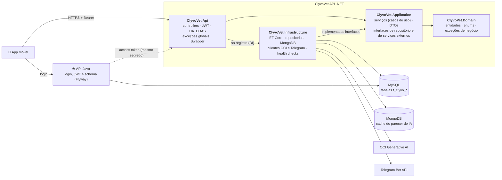

# ClyvoVet API — .NET


API REST de gestão veterinária do **Challenge FIAP 2026 — Clyvo Vet**, feita em ASP.NET Core 8 com Clean Architecture,
EF Core (MySQL), MongoDB, JWT e HATEOAS. É a metade .NET do ClyvoVet; a metade Java é dona do schema e do login.

## Sumário

- [Sobre o Projeto](#sobre-o-projeto)
- [Arquitetura](#arquitetura)
- [Tecnologias](#tecnologias)
- [Estrutura de Pastas](#estrutura-de-pastas)
- [Princípios aplicados](#princípios-aplicados)
- [Como Executar](#como-executar)
- [🔐 Autenticação](#-autenticação)
- [Documentação das Rotas](#documentação-das-rotas)
- [Regras de Negócio](#regras-de-negócio)
- [Enums — Valores Aceitos](#enums--valores-aceitos)
- [Monitoramento e Observabilidade](#monitoramento-e-observabilidade)
- [Testes Automatizados](#testes-automatizados)
- [Schema do Banco de Dados](#schema-do-banco-de-dados)
- [NoSQL — MongoDB (cache do parecer de IA)](#nosql--mongodb-cache-do-parecer-de-ia)
- [Documentação complementar](#documentação-complementar)
- [Integrantes do Grupo](#integrantes-do-grupo)
- [Licença](#licença)

---

## Sobre o Projeto

A **ClyvoVet API** é uma API RESTful feita em **ASP.NET Core 8**, criada dentro do **Challenge FIAP 2026 — projeto Clyvo Vet**. Dentro da plataforma veterinária, ela cobre o **domínio de engajamento**, cuidando de:

- Catálogo de produtos e serviços veterinários
- Sugestões personalizadas de produtos por animal
- Lembretes de saúde e cuidados para tutores
- Eventos pet públicos (campanhas de vacinação, feiras, workshops)
- **Saúde Preditiva com IA generativa** — parecer de riscos e recomendações por animal, redigido pela **OCI Generative AI** sobre uma base agregada de doenças por espécie/raça (datasets Dryad com DOI), com fallback determinístico e cache por animal
- **Widget de Saúde Preditiva** (por regras) — o antecessor, mantido no ar: aponta condições relevantes para a espécie/raça/idade
- **Envio de mensagens no Telegram** — bot próprio; é o canal único de mensagem (lembretes e saúde preditiva)

A entrega junta todas essas funcionalidades numa base só, organizada em quatro frentes:

- **Arquitetura e código:** Clean Architecture em 4 projetos (Domain, Application, Infrastructure, Api), com as regras de dependência verificadas por teste; injeção de dependência; **tratamento global de exceções** com respostas `application/problem+json`.
- **API REST:** **autenticação JWT** (o access token emitido pela API Java) com autorização por perfil; **paginação com total, ordenação e filtros**; **HATEOAS** nas consultas, sem quebrar o contrato do app móvel (o array JSON continua sendo o padrão); Swagger/OpenAPI documentado e exportado.
- **Persistência:** EF Core sobre **MySQL** com o padrão Repository, e **MongoDB** como cache do parecer de IA, com expiração automática por índice TTL.
- **Observabilidade e testes:** **health checks** (`/health`, `/health/live`, `/health/ready`) do MySQL, do MongoDB e do Telegram; **logs estruturados** (JSON fora de `Development`) correlacionados por `X-Correlation-Id`; tracing e métricas com OpenTelemetry (`/metrics`); **537 testes** (323 unitários + 214 de integração) e **99% de cobertura** de linhas em Domain + Application. Um [ensaio geral](docs/ensaio-geral.md) rodou a API inteira contra MySQL e MongoDB reais.

---

## Arquitetura

### Camadas (Clean Architecture)


```mermaid
flowchart LR
    app["📱 App móvel"]
    java["☕ API Java<br/>login, JWT e schema (Flyway)"]

    subgraph dotnet["ClyvoVet API .NET"]
        direction TB
        api["<b>ClyvoVet.Api</b><br/>controllers · JWT · HATEOAS<br/>exceções globais · Swagger"]
        infra["<b>ClyvoVet.Infrastructure</b><br/>EF Core · repositórios · MongoDB<br/>clientes OCI e Telegram · health checks"]
        appl["<b>ClyvoVet.Application</b><br/>serviços (casos de uso) · DTOs<br/>interfaces de repositório e de serviços externos"]
        dom["<b>ClyvoVet.Domain</b><br/>entidades · enums · exceções de negócio"]
        api --> appl
        api -- "só registra (DI)" --> infra
        infra -- "implementa as interfaces" --> appl
        appl --> dom
    end

    mysql[("MySQL<br/>tabelas t_clyvo_*")]
    mongo[("MongoDB<br/>cache do parecer de IA")]
    oci["OCI Generative AI"]
    tg["Telegram Bot API"]

    app -- "HTTPS + Bearer" --> api
    app -- "login" --> java
    java -. "access token (mesmo segredo)" .-> api
    java --> mysql
    infra --> mysql
    infra --> mongo
    infra --> oci
    infra --> tg
```

Cada seta entre as camadas quer dizer "depende de". A dependência sempre aponta para dentro: o **Domain** não conhece
ninguém, a **Application** só conhece o Domain e declara as interfaces de que precisa, e a **Infrastructure** as
implementa. A **Api** só referencia a Infrastructure para registrar as implementações na injeção de dependência.

| Projeto | Contém | Não pode conhecer |
|---|---|---|
| `ClyvoVet.Domain` | entidades, enums, exceções de negócio | nada (zero pacotes) |
| `ClyvoVet.Application` | serviços (casos de uso), DTOs, **interfaces** de repositório e de serviços externos | EF, MongoDB, ASP.NET, Telegram |
| `ClyvoVet.Infrastructure` | EF Core, repositórios concretos, MongoDB, clientes OCI/Telegram, *background services*, health checks de dependência | ASP.NET MVC |
| `ClyvoVet.Api` | controllers, middlewares, Swagger, JWT, HATEOAS, tratamento global de exceções, `Program.cs` | EF, MongoDB (só via Infrastructure) |

Essas regras são **verificadas por teste**:
[`ArquiteturaTests`](tests/ClyvoVet.Api.Tests.Unit/ArquiteturaTests.cs) falha se uma camada passar a referenciar o que
não pode. O diagrama da infraestrutura na nuvem fica em [`docs/arquitetura-azure.svg`](docs/arquitetura-azure.svg).

### Duas APIs, um banco


Duas APIs independentes dividem **um único banco MySQL**, e nenhuma das duas roda
em container: as duas são publicadas como aplicação nativa em **Azure App Service
Linux**, sobre um **Azure Database for MySQL Flexible Server** gerenciado. É a
Opção 2 exigida pela disciplina de DevOps, onde app em container e banco em
container são penalizados. (O `Dockerfile` na raiz continua servindo ao
desenvolvimento local; ele não produz o artefato publicado.)

| API | Responsabilidade | Tabelas gerenciadas |
|-----|-----------------|---------------------|
| **.NET (este projeto)** | Engajamento e catálogo | `t_clyvo_produto`, `t_clyvo_sugestao_produto`, `t_clyvo_lembrete`, `t_clyvo_evento_pet`, `t_clyvo_predisposicao_saude` |
| **Java (parceira)** | Clínica e cadastro | `t_clyvo_tutor`, `t_clyvo_animal`, `t_clyvo_clinica`, `t_clyvo_veterinario`, `t_clyvo_evento_clinico`, `t_clyvo_pagamento` |

> A API .NET **lê** as tabelas de animal e tutor da API Java para validar FKs e enriquecer as respostas — mas **nunca escreve** nelas.

---

## Tecnologias

| Tecnologia | Versão | Uso |
|------------|--------|-----|
| .NET / ASP.NET Core | 8.0 | Framework da API |
| Entity Framework Core | 8.0.11 | ORM, com migrations das 7 tabelas que a API grava |
| Pomelo.EntityFrameworkCore.MySql | 8.0.2 | Provider MySQL para EF Core |
| MongoDB.Driver / MongoDB | 3.12.0 / 7 | Cache NoSQL do parecer de IA (opcional: só com `Mongo:ConnectionString`) |
| Swashbuckle.AspNetCore | 10.1.7 | Geração do Swagger / OpenAPI |
| Microsoft.OpenApi | 2.12.2 | Modelos OpenAPI (namespace atualizado na v2) |
| MySQL | 8.0 | Banco de dados (Azure Database for MySQL Flexible Server na nuvem) |
| Microsoft.Extensions.Diagnostics.HealthChecks | 8.0.11 | Health Checks (`/health`, `/health/live`, `/health/ready`) |
| Serilog.AspNetCore | 10.0.0 | Logging estruturado (console sempre; arquivo em `Development`) |
| OpenTelemetry (.NET SDK) | 1.18.0 | Distributed tracing + métricas de desempenho |
| OpenTelemetry.Exporter.Prometheus.AspNetCore | 1.18.0-beta.1 | Endpoint `/metrics` no formato Prometheus |
| xUnit + Moq | 2.9.3 / 4.20.72 | Testes unitários (padrão AAA) |
| Microsoft.AspNetCore.Mvc.Testing | 8.0.11 | Testes de integração via `WebApplicationFactory` |
| Microsoft.EntityFrameworkCore.InMemory | 8.0.11 | Banco em memória usado nos testes de integração |
| Telegram.Bot | 22.10.3 | Envio de mensagens no Telegram (bot próprio) |

---

## Estrutura de Pastas

```
ClyvoVet-api/
├── src/
│   ├── ClyvoVet.Domain/               → Entidades, enums e exceções de negócio (não conhece nenhum outro projeto)
│   │   ├── Entities/                  → Entidades mapeadas nas tabelas MySQL
│   │   ├── Enums/                     → Enumerações dos valores aceitos pelo banco
│   │   └── Exceptions/                → NotFoundException, BadRequestException, RegistroEmUsoException
│   ├── ClyvoVet.Application/          → Casos de uso; só conhece o Domain
│   │   ├── Services/                  → Regras de negócio (+ Interfaces/)
│   │   ├── DTOs/
│   │   │   ├── Request/               → Dados recebidos nas requisições (POST/PUT)
│   │   │   └── Response/              → Dados retornados nas respostas
│   │   ├── Abstractions/
│   │   │   ├── Repositories/          → Interfaces dos repositórios
│   │   │   └── External/              → Interfaces dos serviços externos (OCI, Telegram)
│   │   └── Security/                  → Escopo do tutor e identidade do chamador
│   ├── ClyvoVet.Infrastructure/       → EF Core, repositórios concretos e integrações externas
│   │   ├── Data/
│   │   │   ├── AppDbContext.cs        → DbContext principal
│   │   │   ├── Configurations/        → Fluent API (mapeamento tabela ↔ modelo)
│   │   │   └── Migrations/            → Migrations do EF Core (só as tabelas que esta API grava)
│   │   ├── Repositories/              → Acesso ao banco via EF Core
│   │   ├── Mongo/                     → Cache do parecer de IA no MongoDB (repositório, índice TTL)
│   │   ├── External/                  → Clientes da OCI Generative AI e do Telegram
│   │   ├── Background/                → Serviços em segundo plano (lembretes, vínculo do Telegram)
│   │   └── HealthChecks/              → Checks do Telegram e do MongoDB
│   └── ClyvoVet.Api/                  → Porta de entrada HTTP
│       ├── Controllers/               → Recebem requisições HTTP e delegam ao Service
│       ├── Extensions/                → Observabilidade (Serilog, OpenTelemetry) e documentação (Swagger)
│       ├── Errors/                    → MapaDeErro (exceção → status HTTP)
│       ├── HealthChecks/              → Formatação JSON do resultado do Health Check
│       ├── Middleware/                → CorrelationIdMiddleware (rastreio de requisições nos logs)
│       ├── Properties/
│       │   └── launchSettings.json
│       ├── appsettings.json           → Connection string MySQL (placeholder) + níveis de log
│       ├── Program.cs                 → Só orquestra: composição dos serviços e pipeline HTTP
│       └── Logs/                      → Log em arquivo do Serilog, só em `Development` (não versionado)
├── tests/
│   ├── ClyvoVet.Api.Tests.Unit/         → Testes unitários (Domain, Application, peças da Api) e regras de arquitetura
│   └── ClyvoVet.Api.Tests.Integration/  → Testes de integração (WebApplicationFactory + EF Core InMemory)
├── docs/                → Documentação complementar (deploy Azure, guia de testes manuais, auditoria, diagrama de infra)
├── scripts/
│   ├── cobertura.sh                 → Mede a cobertura de Domain + Application e falha abaixo de 90%
│   ├── exportar-swagger.sh          → Gera docs/swagger/openapi-v1.json a partir da própria API
│   └── gerar-script-migrations.sh   → Gera schema/ef/migrations-idempotente.sql a partir das migrations
├── docker-compose.yml   → MongoDB de desenvolvimento
├── Dockerfile           → Imagem da API para desenvolvimento local
└── schema/
    ├── script_bd.sql                            → Schema MySQL completo para desenvolvimento local (as duas APIs + seed)
    ├── ef/
    │   ├── migrations-idempotente.sql           → Script gerado das migrations do EF (pode rodar mais de uma vez)
    │   └── baseline-banco-compartilhado.sql     → Marca a migration Inicial como aplicada num banco do Flyway
    ├── 01_criar_tabelas_dotnet.sql             → DDL das 4 tabelas originais + triggers + fn_uuid()
    ├── 02_seed_dotnet.sql                       → Dados de exemplo para os endpoints originais
    ├── 03_drop_tabelas_dotnet.sql               → Remove as 6 tabelas .NET
    ├── 04_criar_tabela_predisposicao_dotnet.sql → DDL da tabela do Widget de Saúde Preditiva
    ├── 05_seed_predisposicao_dotnet.sql         → 42 predisposições reais por espécie/raça/idade
    ├── 06_criar_tabela_tutor_telegram_dotnet.sql → DDL da tabela de vínculo Tutor ↔ Telegram
    └── README.md                                → Guia do schema
```

---

## Princípios aplicados

Cada princípio com um exemplo real do código (arquivo e linha):

| Princípio | Onde | O que mostra |
|---|---|---|
| **S** — responsabilidade única | [`MapaDeErro.cs:21`](src/ClyvoVet.Api/Errors/MapaDeErro.cs#L21) | Uma classe só traduz exceção de negócio em status HTTP; o tratador global só a chama. Controllers delegam ao *service* e não têm regra de negócio. |
| **O** — aberto/fechado | [`ProdutoRepository.cs:15`](src/ClyvoVet.Infrastructure/Repositories/ProdutoRepository.cs#L15) e [`Ordenacao.cs:25`](src/ClyvoVet.Infrastructure/Repositories/Ordenacao.cs#L25) | Tornar um campo ordenável é uma entrada na lista branca do repositório; a `Ordenacao` não muda. |
| **L** — substituição de Liskov | [`InfrastructureServiceExtensions.cs:83`](src/ClyvoVet.Infrastructure/InfrastructureServiceExtensions.cs#L83) e [`MongoServiceExtensions.cs:39`](src/ClyvoVet.Infrastructure/Mongo/MongoServiceExtensions.cs#L39) | `ParecerIaRepository` (MySQL) e `ParecerIaMongoRepository` são trocados por configuração sem o `SaudePreditivaService` perceber. |
| **I** — segregação de interfaces | [`IParecerIaRepository.cs:5`](src/ClyvoVet.Application/Abstractions/Repositories/IParecerIaRepository.cs#L5) | Uma interface por recurso, só com o que o caso de uso usa (aqui, dois métodos), em vez de um repositório genérico com tudo. |
| **D** — inversão de dependência | [`SaudePreditivaService.cs:47`](src/ClyvoVet.Application/Services/SaudePreditivaService.cs#L47) e [`ArquiteturaTests.cs:51`](tests/ClyvoVet.Api.Tests.Unit/ArquiteturaTests.cs#L51) | A Application depende só de interfaces que ela mesma declara; a Infrastructure as implementa. Um teste falha se a Application passar a referenciar EF, MongoDB ou ASP.NET. |

**Clean Code:** nomes do domínio em português, comentários que explicam o porquê (não o quê) e métodos curtos. Uma revisão de
SOLID e Clean Code nas quatro camadas gerou cinco correções, cada uma num commit `refactor:` próprio — entre elas, a checagem de
escopo do tutor centralizada num só lugar, a regra da série de lembretes movida para a entidade e o `SaudePreditivaService`
dividido em prompt, leitura da resposta da IA, regras e perfil do animal (de 425 para 213 linhas).

---

## Como Executar

### Pré-requisitos

| Ferramenta | Versão mínima | Para que serve |
|------------|--------------|----------------|
| [.NET SDK](https://dotnet.microsoft.com/download/dotnet/8.0) | 8.0 | Compilar e rodar a API |
| MySQL | 8.0+ | Banco de dados |
| Cliente `mysql` | Qualquer | Criar o banco e aplicar `schema/script_bd.sql` |
| Git | Qualquer | Clonar o repositório |

---

### Passo 1 — Clonar o repositório

```bash
git clone https://github.com/Clyvovet-Challenge/ClyvoVet-api.git
cd ClyvoVet-api
```

**Verifique se o clone funcionou:**

```bash
ls
# Deve listar: src/  tests/  schema/  README.md  ClyvoVet-api.slnx  ...
```

> **Erro: `git: command not found`**  
> Significa que o Git não está instalado na máquina. Instale a partir de [git-scm.com](https://git-scm.com), ou use "Code → Download ZIP" direto no GitHub.

> **Erro: `Repository not found`**  
> Verifique se a URL está correta e se o repositório está público.

---

### Passo 2 — Configurar a connection string

> **Se você tem um clone antigo:** a chave mudou. Era `ConnectionStrings:OracleConnection`,
> apontando para o Oracle da FIAP; hoje o projeto usa **MySQL** via
> `Pomelo.EntityFrameworkCore.MySql`, e o `Program.cs` lê
> **`ConnectionStrings:DefaultConnection`**. Um secret antigo com o nome velho é
> simplesmente ignorado, e a API sobe reclamando de connection string ausente.

Por ficar versionado no repositório, `src/ClyvoVet.Api/appsettings.json` guarda apenas um **placeholder** — evite colocar sua senha real ali, sob risco de subir a credencial sem perceber. O caminho recomendado é o **User Secrets** do .NET: ele mantém a connection string **fora da pasta do projeto**, num arquivo local que o `git` nunca enxerga:

```bash
cd src/ClyvoVet.Api
dotnet user-secrets set "ConnectionStrings:DefaultConnection" "Server=localhost;Port=3306;Database=clyvovet;Uid=root;Pwd=SUA_SENHA_LOCAL;"
```

> Na primeira vez, se o projeto ainda não tem um `UserSecretsId`, rode antes: `dotnet user-secrets init`.

Em ambiente de desenvolvimento, a API lê o User Secrets sozinha, então não sobra mais nada para editar. Para ver o que foi salvo:

```bash
dotnet user-secrets list
```

**Alternativa (menos segura):** colocar a connection string direto no `appsettings.json` local. Funciona do mesmo jeito, mas assim que a senha real estiver ali, **evite comitar** o arquivo — cheque com `git status` antes de qualquer commit.

```json
{
  "ConnectionStrings": {
    "DefaultConnection": "Server=localhost;Port=3306;Database=clyvovet;Uid=root;Pwd=SUA_SENHA_LOCAL;"
  }
}
```

**Formato da connection string MySQL:**

| Parte | Exemplo | Descrição |
|-------|---------|-----------|
| `Server` | `localhost` | Host do MySQL |
| `Port` | `3306` | Porta (o padrão do MySQL) |
| `Database` | `clyvovet` | Nome do banco |
| `Uid` / `Pwd` | `root` / sua senha | Credenciais |
| `SslMode` | `Required` | **Obrigatório na Azure**; dispensável em `localhost` |

**Contra o banco da Azure** (o mesmo que a API Java usa), acrescente o TLS — o MySQL Flexible Server recusa a conexão sem ele:

```
Server=<SERVIDOR>.mysql.database.azure.com;Port=3306;Database=clyvovet;Uid=clyvovetadmin;Pwd=<SENHA>;SslMode=Required;
```

> **Erro: `Unable to connect to any of the specified MySQL hosts`**
> O MySQL não está no ar ou o host/porta estão errados. Confira com `mysql -h localhost -u root -p`.

> **Erro: `Access denied for user`**
> Usuário ou senha incorretos no `Uid`/`Pwd`.

> **Erro: `Unknown database 'clyvovet'`**
> O banco ainda não existe. É o Passo 3.

> **Erro na Azure: `The SSL connection could not be established`**
> Faltou `SslMode=Required;` na connection string.

---

### Passo 3 — Preparar o banco de dados

> ⚠️ **Só para desenvolvimento local.** No banco da Azure **não execute nada disto**:
> lá o banco nasce vazio e quem cria o schema é o **Flyway da API Java**, no primeiro
> boot dela. Aplicar DDL antes deixa as tabelas sem a `flyway_schema_history`, e o
> Flyway então recusa migrar um schema não vazio que ele não conhece — a API Java
> não sobe.

#### 3.1 — Criar o banco e aplicar o schema

```bash
mysql -u root -p -e "CREATE DATABASE IF NOT EXISTS clyvovet CHARACTER SET utf8mb4 COLLATE utf8mb4_unicode_ci;"
mysql -u root -p clyvovet < schema/script_bd.sql
```

[`schema/script_bd.sql`](schema/script_bd.sql) é o schema completo em **MySQL**, nas duas partes:

| Parte | Tabelas | Quem escreve |
|---|---|---|
| **1** | `t_clyvo_tutor`, `t_clyvo_animal`, `t_clyvo_clinica`, `t_clyvo_veterinario`, … | a **API Java** — aqui elas existem para as FKs e os JOINs; esta API só lê |
| **2** | `t_clyvo_produto`, `t_clyvo_sugestao_produto`, `t_clyvo_lembrete`, `t_clyvo_evento_pet`, `t_clyvo_predisposicao_saude`, `t_clyvo_tutor_telegram` | esta API |

O arquivo já inclui a carga inicial: produtos, eventos pet, um tutor e um animal de
exemplo, as predisposições de saúde do Widget e a tabela de vínculo com o Telegram.
Não há passo separado para nenhum deles.

#### 3.2 — Conferir

```bash
mysql -u root -p clyvovet -e "
SELECT TABLE_NAME, TABLE_ROWS FROM information_schema.TABLES
 WHERE TABLE_SCHEMA = 'clyvovet' AND TABLE_NAME LIKE 't_clyvo_%'
 ORDER BY TABLE_NAME;"
```

Se `t_clyvo_produto` e `t_clyvo_predisposicao_saude` aparecerem com linhas, o seed
entrou. Sem as predisposições, `GET /api/v1/widget-saude-preditiva/{animalId}`
responde normalmente, mas sempre com a lista vazia.

> **Os arquivos `schema/01_*.sql` a `schema/06_*.sql` são do tempo do Oracle** —
> `VARCHAR2`, `NUMBER`, triggers `BEFORE INSERT` e a função `fn_clyvo_uuid`. Eles
> não rodam no MySQL e ficam apenas como registro histórico. Os scripts vigentes são o
> `script_bd.sql` e os de `schema/ef/`, descritos a seguir.

#### 3.3 — Migrations do EF Core

As tabelas que **esta API grava** têm migrations do EF Core, em
[`src/ClyvoVet.Infrastructure/Data/Migrations/`](src/ClyvoVet.Infrastructure/Data/Migrations/):

| Na migration (a API grava) | Fora dela (a API só lê) |
|---|---|
| `t_clyvo_produto`, `t_clyvo_sugestao_produto`, `t_clyvo_lembrete`, `t_clyvo_evento_pet`, `t_clyvo_predisposicao_saude`, `t_clyvo_tutor_telegram`, `t_clyvo_parecer_ia` | `t_clyvo_animal`, `t_clyvo_tutor`, `t_clyvo_raca`, `t_clyvo_base_doencas` |

A regra é verificável no código: entra na migration a tabela cujo repositório tem
`Add`/`Update`. As outras quatro também começam com `t_clyvo_`, mas o schema e o seed
delas são da API Java, e por isso ficam de fora com `ExcludeFromMigrations()` — o EF
ainda as mapeia para as consultas e os JOINs, só não tenta criá-las.

**A API não roda `Database.Migrate()` ao subir.** O banco é compartilhado, e quem sobe
primeiro não pode decidir o schema do outro. As migrations viram um script SQL
revisável, aplicado à mão:

```bash
scripts/gerar-script-migrations.sh    # regera schema/ef/migrations-idempotente.sql a partir das migrations
```

| Arquivo | O que faz | Quando usar |
|---|---|---|
| [`schema/ef/migrations-idempotente.sql`](schema/ef/migrations-idempotente.sql) | Cria as 7 tabelas e registra a migration em `__EFMigrationsHistory`. Cada migration só roda se ainda não estiver no histórico, então aplicar duas vezes não faz nada na segunda | Banco em que o Flyway da Java já rodou e as 7 tabelas ainda não existem |
| [`schema/ef/baseline-banco-compartilhado.sql`](schema/ef/baseline-banco-compartilhado.sql) | Só registra a migration `Inicial` como aplicada, sem criar nada | Banco montado pelo Flyway da Java, onde as 7 tabelas já existem (produção) |

**A ordem é sempre Flyway da Java → EF.** Num banco compartilhado:

```bash
# 1. a API Java sobe uma vez (o Flyway cria o schema inteiro, V1 em diante)
mysql -u root -p clyvovet < schema/ef/baseline-banco-compartilhado.sql   # 2. marca a Inicial como aplicada
mysql -u root -p clyvovet < schema/ef/migrations-idempotente.sql         # 3. aplica só o que vier depois dela
```

Rodar o script do EF **antes** do Flyway, num banco vazio, é a única forma de quebrar a
API Java: a `t_clyvo_lembrete` tem FK para a `t_clyvo_animal`, que ainda não existe
(`ERROR 1824`), e o que o script chegou a criar deixa o schema "não vazio" sem
`flyway_schema_history` — o Flyway então recusa a V1.

**Onde o EF e o Flyway diferem.** Comparando o `information_schema` dos dois lados
(colunas, índices, FKs, CHECKs, collation e engine), sobram quatro diferenças, todas
sem efeito no comportamento da API:

| Diferença | Flyway (Java) | EF | Por que fica assim |
|---|---|---|---|
| `DEFAULT` nas colunas | tem | não tem | A API sempre manda todos os valores no `INSERT`. `HasDefaultValue(true)` num `bool` faria o EF omitir o `false` e o banco gravar `true` |
| `produto.categoria` e `produto.especie_indicada` | aceitam `NULL` | `NOT NULL` | Na entidade C# são obrigatórias; a API nunca grava `NULL` nelas |
| Colunas booleanas | `TINYINT` | `TINYINT(1)` | É como o Pomelo mapeia `bool`; guardam os mesmos valores |
| FK `sugestao_produto → produto` | `NO ACTION` | `RESTRICT` | No InnoDB as duas regras são a mesma coisa |

Depois de mudar uma entidade ou uma configuração do EF: criar a migration
(`dotnet tool restore` e depois
`dotnet ef migrations add <Nome> --project src/ClyvoVet.Infrastructure --startup-project src/ClyvoVet.Api`),
rodar `scripts/gerar-script-migrations.sh` e commitar o SQL junto. Três classes de teste de
unidade seguram isso: `MigrationsTests` falha se o modelo mudou sem migration nova;
`EscopoDasMigrationsTests` falha se uma tabela nova não for classificada como "grava" ou "só
lê"; `EspelhoDoFlywayTests` confere nomes de índice, CHECKs, regras de FK e tipos contra o Flyway.

---

### Passo 4 — Restaurar pacotes

Na raiz do projeto:

```bash
cd src/ClyvoVet.Api
dotnet restore
```

Output esperado:

```
Restaurando pacotes de C:\...\ClyvoVet.Api.csproj...
  Determinando projetos a serem restaurados...
  Todos os projetos estão atualizados.
```

> **Erro: `dotnet: command not found`**  
> O .NET SDK não está instalado, ou não está no PATH. Instale a partir de [dotnet.microsoft.com](https://dotnet.microsoft.com/download/dotnet/8.0) e reinicie o terminal em seguida.

> **Erro: `NETSDK1045: The current .NET SDK does not support targeting .NET 8.0`**  
> A versão do SDK instalada não é compatível. Rode `dotnet --version` para ver qual está ativa — é preciso ter **8.0.x ou superior**.

> **Erro: `Unable to load the service index for source https://api.nuget.org`**  
> Falta acesso à internet para baixar os pacotes. Verifique sua conexão, ou configure um proxy NuGet se estiver numa rede corporativa.

---

### Passo 5 — Executar a API

```bash
dotnet run
```

Output esperado:

```
info: Microsoft.Hosting.Lifetime[14]
      Now listening on: http://localhost:5191
      Now listening on: https://localhost:7225
info: Microsoft.Hosting.Lifetime[0]
      Application started. Press Ctrl+C to shut down.
```

> **Erro: `Failed to bind to address http://localhost:5191: address already in use`**  
> A porta 5191 já está em uso por outro processo. Encerre esse processo:
> ```bash
> # Windows
> netstat -ano | findstr :5191
> taskkill /PID <numero_do_pid> /F
> ```
> Ou mude a porta em `Properties/launchSettings.json`.

> **Erro: `Unable to connect to any of the specified MySQL hosts` na primeira requisição**  
> A connection string está errada — volte ao Passo 2. Mesmo com credenciais inválidas a aplicação sobe normalmente; o erro só se manifesta na primeira chamada ao banco.

> **Erro: `Table 'clyvovet.t_clyvo_produto' doesn't exist`**  
> O banco existe mas está vazio: falta aplicar `schema/script_bd.sql` (Passo 3).

> **A API sobe mas retorna `500` em todos os endpoints**  
> Confira os logs no terminal — é ali que o erro real aparece. As causas mais frequentes:
> - Connection string incorreta (usuário, senha ou service name)
> - Tabelas ainda não criadas (rode o script `01` primeiro)
> - Tipo de dado não mapeado no EF Core

---

### Passo 6 — Acessar o Swagger

Com a API rodando, abra no navegador:

| Perfil | URL |
|--------|-----|
| HTTP (recomendado para testes) | http://localhost:5191/swagger |
| HTTPS | https://localhost:7225/swagger |

Todos os endpoints aparecem no Swagger, agrupados por controller.

> **O Swagger fica sempre ativo** — não é restrito ao ambiente `Development`, funcionando em Docker, servidor e produção.

> **Erro: `ERR_CONNECTION_RESET` ou `ERR_SSL_PROTOCOL_ERROR` no HTTPS**  
> O certificado de desenvolvimento ainda não é confiável. Rode:
> ```bash
> dotnet dev-certs https --clean
> dotnet dev-certs https --trust
> ```
> Confirme na janela que o Windows abrir e reinicie a aplicação. Persistindo o problema, use a URL HTTP.

> **Swagger abre mas mostra "Failed to fetch" ao executar endpoints**  
> Sinal de que o Swagger está tentando HTTPS com um certificado inválido. Clique em "Servers" no topo e escolha a URL HTTP (`http://localhost:5191`).

> **Página em branco ou `404` ao acessar `/swagger`**  
> A aplicação está no ar, mas o Swagger não foi servido. Confira, em `Program.cs`, se `app.UseSwagger()` e `app.UseSwaggerUI()` estão **fora** de qualquer bloco `if (app.Environment.IsDevelopment())`.

---

### Alternativa — Executar via Visual Studio ou Rider

1. Abra `ClyvoVet-api.slnx` na IDE
2. Selecione o perfil `http` no dropdown de execução
3. Pressione **F5** (com debug) ou **Ctrl+F5** (sem debug)
4. O navegador abre sozinho no Swagger

> **Visual Studio:** se o navegador abrir em `weatherforecast`, ou numa página em branco, confira se `launchUrl`, em `Properties/launchSettings.json`, está definido como `"swagger"`.

---

### Verificação rápida — API funcionando

Com a API no ar, faça uma requisição de teste:

```bash
curl http://localhost:5191/api/v1/produtos \
  -H "Authorization: Bearer SEU_ACCESS_TOKEN" -H "X-Api-Key: SUA_CHAVE_AQUI"
```

Sem as duas credenciais a resposta é `401` (veja [🔐 Autenticação](#-autenticação)). Para só conferir que a API subiu, sem credencial: `curl http://localhost:5191/health/live`.

**Resposta esperada:** um array JSON com os produtos do seed. Vindo `[]`, o banco está conectado mas o seed não rodou; vindo `{"error": "Erro interno no servidor."}`, há algo errado na connection string — confira os logs do terminal.

---

## 🔐 Autenticação

Os endpoints de negócio exigem **duas credenciais**: `Authorization: Bearer <access token>` (emitido pela API Java no login) **e** o header `X-Api-Key`. Sem o Bearer a resposta é `401 Unauthorized`; com um perfil sem permissão, `403 Forbidden`. A `X-Api-Key` ausente ou errada também devolve `401`.

| Endpoints | Quem acessa |
|---|---|
| Lembretes, Eventos Pet, Sugestões de Produto, Saúde Preditiva, Widget, `GET` de Produtos | qualquer usuário autenticado |
| `POST`/`PUT`/`DELETE` de Produtos | `ADMIN` ou `VETERINARIO` |
| Telegram | chaves próprias (`Api:ApiKey` / `Telegram:ApiKey`), como antes |
| `/health*`, `/metrics`, `/swagger` | anônimos |

Só o **access token** vale: o *refresh token* (7 dias) é recusado.

| Variável de ambiente | Para quê |
|---|---|
| `Jwt__Secret` | o **mesmo** valor de `JWT_SECRET` da API Java (base64; a chave é o valor *decodificado*) |
| `Jwt__Emissor`, `Jwt__Publico` | opcionais; padrões `clyvovet-api-java` e `clyvovet` |
| `Auth__ExigirToken` | `false` desliga a exigência do Bearer (alavanca de emergência); padrão `true` |
| `Api__EscopoPorTutor` | `true` liga o recorte por tutor: um TUTOR só vê os próprios animais, lembretes e sugestões, e o recurso de outro tutor responde `404`. Padrão **desligado** |

```bash
dotnet user-secrets set "Api:ApiKey" "SUA_CHAVE_AQUI"
dotnet user-secrets set "Jwt:Secret" "O_MESMO_JWT_SECRET_DA_API_JAVA"
```

```bash
curl http://localhost:5191/api/v1/lembretes \
  -H "Authorization: Bearer SEU_ACCESS_TOKEN" -H "X-Api-Key: SUA_CHAVE_AQUI"
```

No Swagger (`/swagger`), clique em **"Authorize"** (canto superior direito) e informe a `X-Api-Key` e o token do esquema `Bearer` (só o token: o Swagger acrescenta o prefixo) uma única vez — a partir daí ambos são aplicados automaticamente em toda chamada feita por ali.

> O **envio** do Telegram segue o mesmo mecanismo, só que com chave própria (`Telegram:ApiKey`), porque manda mensagem para qualquer `chatId`. As ações de **vínculo** do tutor (`link`, `vinculo`) usam esta `Api:ApiKey` — detalhes na seção correspondente, mais abaixo.

### Checklist de deploy (Render)

1. Defina `Jwt__Secret` no serviço **antes** do deploy, com o mesmo valor do `JWT_SECRET` da API Java. Sem ele a aplicação sobe, registra um `Warning` e **todas as rotas protegidas respondem 401**.
2. Confirme nos logs da subida que **não** há a mensagem "Jwt:Secret não configurado".
3. Teste `GET /health/live` (200) e uma rota protegida sem token (401) e com token (200).
4. Rollback rápido, sem redeploy: `Auth__ExigirToken=false`.

### Quem faz o login: a API Java

Procurando as **credenciais de teste do tutor, do veterinário ou do admin**? Elas não existem aqui. Esta API **não emite** token nem tem tela de login: ela **valida** o access token que a API Java emite (o mesmo `Jwt__Secret` nos dois lados) e lê dele o perfil e o tutor. Para chamar as rotas protegidas, faça login na API Java e use o access token da resposta.

Os quatro perfis (`TUTOR`, `VETERINARIO`, `ADMIN_CLINICA`, `ADMIN`) vivem na **API Java**, que é a dona do cadastro, das sessões e das autorizações. As contas de desenvolvimento estão documentadas lá:

| E-mail | Senha | Perfil |
|---|---|---|
| `lucas.santos@email.com` | `tutor12345` | `TUTOR` |
| `maria.oliveira@email.com` | `tutor12345` | `TUTOR` |
| `camila.ferreira@vetcare.com.br` | `vet12345` | `VETERINARIO` |
| `gestor.vetcare@clyvovet.com` | `gestor12345` | `ADMIN_CLINICA` |
| `admin@clyvovet.com` | `admin12345` | `ADMIN` |

Semeadas pelo `DevDataSeeder` nos perfis Spring `dev`, `h2`, `oracle` e `local` — nunca em produção. No stack do Docker isso exige `SPRING_PROFILES_ACTIVE=mysql,local` no serviço `java-api`; com `mysql` sozinho o banco sobe sem usuário e todo login devolve 401.

---

## Documentação das Rotas

> **Base path:** `/api/v1/`  
> Toda resposta de endpoint vem em `application/json`; as respostas de **erro** vêm em `application/problem+json`, com o campo `error` (e, em falha de servidor, `referencia`).

**Swagger exportado:** o documento OpenAPI completo (26 operações em 7 recursos) está em
[`docs/swagger/openapi-v1.json`](docs/swagger/openapi-v1.json). Ele pode ser aberto no
[Swagger Editor](https://editor.swagger.io) ou importado no Postman/Insomnia. É gerado pela própria API; depois de
mudar uma rota, rode de novo:

```bash
scripts/exportar-swagger.sh      # sobe a API em Production numa porta local, salva o JSON e encerra
```

### 📄 Paginação, ordenação e navegação (HATEOAS)

As listagens (`/lembretes`, `/eventos-pet`, `/produtos`, `/sugestoes-produto`) aceitam:

| Parâmetro | Para quê |
|---|---|
| `page`, `pageSize` | página (a partir de 1) e tamanho (1 a 100; padrão 10) |
| `ordenarPor` | campo de ordenação em camelCase (a lista de cada recurso está no Swagger). Campo fora da lista → `400`. Sem ele, vale a ordem de sempre |
| `direcao` | `asc` (padrão) ou `desc`; ignorada sem `ordenarPor` |

**Resposta padrão.** O corpo continua sendo um **array JSON** (é o que o app móvel lê). O total e a navegação vão nos
cabeçalhos `X-Total-Count` e `Link` (RFC 8288), e cada item traz `_links`:

```bash
curl -i "http://localhost:5191/api/v1/produtos?pageSize=2&ordenarPor=preco&direcao=desc" \
  -H "Authorization: Bearer SEU_ACCESS_TOKEN" -H "X-Api-Key: SUA_CHAVE_AQUI"
```

```text
HTTP/1.1 200 OK
Content-Type: application/json
X-Total-Count: 42
Link: </api/v1/produtos?ordenarPor=preco&direcao=desc&page=1&pageSize=2>; rel="first", </api/v1/produtos?ordenarPor=preco&direcao=desc&page=2&pageSize=2>; rel="next", </api/v1/produtos?ordenarPor=preco&direcao=desc&page=21&pageSize=2>; rel="last"

[{ "id": "…", "nome": "…", "_links": { "self": { "href": "/api/v1/produtos/…", "method": "GET" },
   "atualizar": { "href": "/api/v1/produtos/…", "method": "PUT" }, "excluir": { "href": "/api/v1/produtos/…", "method": "DELETE" },
   "colecao": { "href": "/api/v1/produtos", "method": "GET" } } }, …]
```

**Envelope opcional.** Com `Accept: application/vnd.clyvovet.hateoas+json` a listagem devolve o envelope completo:

```bash
curl "http://localhost:5191/api/v1/produtos?pageSize=2" \
  -H "Authorization: Bearer SEU_ACCESS_TOKEN" -H "X-Api-Key: SUA_CHAVE_AQUI" \
  -H "Accept: application/vnd.clyvovet.hateoas+json"
```

```json
{ "itens": [ … ], "page": 1, "pageSize": 2, "total": 42,
  "_links": { "self": {…}, "first": {…}, "next": {…}, "last": {…} } }
```

`prev` e `next` só aparecem quando existem, e os links preservam os filtros, `ordenarPor` e `direcao`. Quem não pedir o envelope
recebe o array de sempre.

---

### 🛒 Produtos — `/api/v1/produtos`

Trata do catálogo de produtos e serviços veterinários (`T_CLYVO_PRODUTO`).

| Método | Rota | Descrição | Status |
|--------|------|-----------|--------|
| GET | `/api/v1/produtos` | Lista produtos com filtros e paginação | 200, 400 |
| GET | `/api/v1/produtos/{id}` | Busca produto por ID | 200, 404 |
| POST | `/api/v1/produtos` | Cadastra novo produto | 201, 400 |
| PUT | `/api/v1/produtos/{id}` | Atualiza produto existente | 200, 400, 404 |
| DELETE | `/api/v1/produtos/{id}` | Remove produto | 204, 404 |

**Query params — GET `/api/v1/produtos`**

| Parâmetro | Tipo | Padrão | Descrição |
|-----------|------|--------|-----------|
| `page` | int | 1 | Número da página |
| `pageSize` | int | 10 | Itens por página (máx. 100) |
| `categoria` | enum | — | `Racao` \| `Medicamento` \| `Acessorio` \| `Servico` \| `Outro` |
| `especieIndicada` | enum | — | `Cachorro` \| `Gato` \| `Passaro` \| `Reptil` \| `Roedor` \| `Todos` \| `Outro` \| `Bovino` \| `Equino`. **Traz junto os marcados `Todos`** |
| `porteIndicado` | enum | — | `Pequeno` \| `Medio` \| `Grande` \| `Todos`. **Traz junto os marcados `Todos`** |
| `ativo` | bool | — | `true` só ativos, `false` só inativos. Omitido, traz os dois |

> **`especieIndicada` inclui os universais.** Pedir `Cachorro` devolve os produtos de cachorro **e** os marcados `Todos` — consulta de rotina, banho, o que não é específico de espécie. Antes o filtro usava igualdade exata, e perguntar "o que serve para um cachorro" escondia justamente o que serve para qualquer animal. Para ver só os universais, peça `especieIndicada=Todos`.

> **`porteIndicado` (coluna `porte_indicado`, migration `V16`).** Espécie sozinha não resolvia o caso mais comum da categoria mais comum: ração de cachorro pequeno e de cachorro grande são produtos diferentes, com outra formulação e outra granulometria, e ambos apareciam para qualquer cachorro. Coleira, casinha e dosagem de antipulgas têm o mesmo problema. O default é `TODOS`, o que preserva o comportamento anterior à coluna — produto que não declara porte continua servindo a qualquer animal e continua aparecendo. Os valores espelham `t_clyvo_animal.porte` (`PEQUENO`/`MEDIO`/`GRANDE`), em maiúscula, porque é assim que o `AnimalMapper` do Java grava e é assim que os dois lados se comparam — no Oracle, divergir na caixa faria o casamento falhar em silêncio.

> **`ativo` passou a ser lido.** O campo existia no modelo, no banco e no `PUT`, e nenhuma consulta o consultava: desativar um produto não o tirava de lugar nenhum. O parâmetro é opcional para não mudar o comportamento de quem já chamava sem ele — a vitrine do app pede `ativo=true`, e a gestão da clínica omite, porque precisa enxergar o que desativou para poder reativar. O mesmo vale para `GET /api/v1/sugestoes-produto`.

> ⚠️ **Enum por nome vale no query param, não no corpo.** `?categoria=Racao` funciona; no JSON do `POST`/`PUT` o valor precisa ser o **ordinal** (`"categoria": 0`), porque a API não registra `JsonStringEnumConverter`. Mandar o nome no corpo devolve 400 com `The JSON value could not be converted`.

**Request — POST / PUT**

```json
{
  "nome": "Ração Golden Adulto 15kg",
  "descricao": "Ração premium para cães adultos, rica em proteínas e ômega-3.",
  "categoria": 0,
  "preco": 189.90,
  "especieIndicada": 0,
  "ativo": true
}
```

**Response — GET / POST / PUT**

```json
{
  "id": "a1b2c3d4-e5f6-7890-abcd-ef1234567890",
  "nome": "Ração Golden Adulto 15kg",
  "descricao": "Ração premium para cães adultos, rica em proteínas e ômega-3.",
  "categoria": 0,
  "preco": 189.90,
  "especieIndicada": 0,
  "ativo": true,
  "criadoEm": "2026-05-24T10:30:00"
}
```

---

### 🐾 Eventos Pet — `/api/v1/eventos-pet`

Trata dos eventos públicos para pets (`T_CLYVO_EVENTO_PET`), sem depender de FK com as tabelas Java.

| Método | Rota | Descrição | Status |
|--------|------|-----------|--------|
| GET | `/api/v1/eventos-pet` | Lista eventos com filtros e paginação | 200, 400 |
| GET | `/api/v1/eventos-pet/{id}` | Busca evento por ID | 200, 404 |
| POST | `/api/v1/eventos-pet` | Cadastra novo evento | 201, 400 |
| PUT | `/api/v1/eventos-pet/{id}` | Atualiza evento existente | 200, 400, 404 |
| DELETE | `/api/v1/eventos-pet/{id}` | Remove evento | 204, 404 |

**Query params — GET `/api/v1/eventos-pet`**

| Parâmetro | Tipo | Padrão | Descrição |
|-----------|------|--------|-----------|
| `page` | int | 1 | Número da página |
| `pageSize` | int | 10 | Itens por página (máx. 100) |
| `cidade` | string | — | Filtra por cidade (case-insensitive) |
| `tipo` | enum | — | `Vacinacao` \| `Feira` \| `Castracao` \| `Workshop` \| `Outro` |
| `especieAlvo` | enum | — | `Cachorro` \| `Gato` \| `Passaro` \| `Reptil` \| `Roedor` \| `Todos` \| `Outro` \| `Bovino` \| `Equino` |

**Request — POST / PUT**

```json
{
  "titulo": "Feira de Adoção Responsável",
  "descricao": "Feira com cães e gatos disponíveis para adoção. Microchipagem gratuita.",
  "tipo": 1,
  "rua": "Av. Paulista",
  "numero": "1578",
  "bairro": "Bela Vista",
  "cidade": "São Paulo",
  "estado": "SP",
  "cep": "01310-200",
  "dataInicio": "2026-08-10",
  "dataFim": "2026-08-11",
  "especieAlvo": 5,
  "organizador": "ONG Amigo Fiel",
  "gratuito": true,
  "linkInscricao": "https://amigofiel.org.br/feira",
  "ativo": true
}
```

**Response — GET / POST / PUT**

```json
{
  "id": "b2c3d4e5-f6a7-8901-bcde-f12345678901",
  "titulo": "Feira de Adoção Responsável",
  "descricao": "Feira com cães e gatos disponíveis para adoção. Microchipagem gratuita.",
  "tipo": 1,
  "rua": "Av. Paulista",
  "numero": "1578",
  "bairro": "Bela Vista",
  "cidade": "São Paulo",
  "estado": "SP",
  "cep": "01310-200",
  "dataInicio": "2026-08-10",
  "dataFim": "2026-08-11",
  "especieAlvo": 5,
  "organizador": "ONG Amigo Fiel",
  "gratuito": true,
  "linkInscricao": "https://amigofiel.org.br/feira",
  "ativo": true,
  "criadoEm": "2026-05-24T10:30:00"
}
```

---

### 🔔 Lembretes — `/api/v1/lembretes`

Trata dos lembretes de cuidados vinculados a um animal (`T_CLYVO_LEMBRETE`).  
⚠️ Exige `animalId` válido em `T_CLYVO_ANIMAL` (e que `T_CLYVO_TUTOR` já exista).

| Método | Rota | Descrição | Status |
|--------|------|-----------|--------|
| GET | `/api/v1/lembretes` | Lista lembretes com filtros e paginação | 200, 400 |
| GET | `/api/v1/lembretes/{id}` | Busca lembrete por ID | 200, 404 |
| POST | `/api/v1/lembretes` | Cria novo lembrete | 201, 400, 404 |
| PUT | `/api/v1/lembretes/{id}` | Atualiza lembrete existente | 200, 400, 404 |
| DELETE | `/api/v1/lembretes/{id}` | Remove lembrete | 204, 404 |

**Query params — GET `/api/v1/lembretes`**

| Parâmetro | Tipo | Padrão | Descrição |
|-----------|------|--------|-----------|
| `page` | int | 1 | Número da página |
| `pageSize` | int | 10 | Itens por página (máx. 100) |
| `animalId` | string | — | UUID do animal (filtra por animal específico) |
| `status` | enum | — | `Pendente` \| `Enviado` \| `Cancelado` |
| `tipo` | enum | — | `Vacina` \| `Medicamento` \| `Consulta` \| `Higiene` \| `Outro` |

**Request — POST / PUT**

```json
{
  "animalId": "<uuid-do-animal>",
  "titulo": "Antibiótico — 10 dias",
  "descricao": "Uma dose por dia, sempre no mesmo horário.",
  "tipo": 1,
  "agendadoEm": "2026-09-15T10:00:00",
  "intervaloDias": 1,
  "repetirAte": "2026-09-25T23:59:00",
  "status": 0
}
```

> **Atenção:** na criação, o `status` é **sempre forçado para `Pendente` (0)**, seja qual for o valor enviado.  
> `agendadoEm` precisa ser uma data/hora **futura**.

**A repetição (V18)**

`intervaloDias` é quem decide se o lembrete volta: nulo ou ausente = dispara uma
vez. `repetirAte` fecha a série — é o "de x dia até y dia", com `agendadoEm` no
começo. Nulo = repete sem fim previsto, que é o caso do antipulgas mensal.

| Campo | Regra |
|---|---|
| `intervaloDias` | 1 a 365. Fora disso, **400** |
| `repetirAte` | exige `intervaloDias`; sem ele, **400** |
| `repetirAte` | não pode ser anterior a `agendadoEm`; se for, **400** |
| `recorrente` | **derivado** de `intervaloDias`. Aceito no corpo e ignorado |

> **`recorrente` não é fonte de verdade.** Ele existia antes da V18, era gravado,
> lido e mapeado em oito lugares — e **nada no sistema agia sobre ele**: um
> lembrete "recorrente" disparava uma vez e virava `Enviado`. A coluna ficou por
> compatibilidade (o app a lê), e agora a API a calcula a partir do intervalo. Um
> corpo com `"recorrente": true` e sem `intervaloDias` grava `false`.

**Como a série anda:** ao notificar um lembrete com intervalo, a API **não cria
linha nova** — ela empurra `agendadoEm` para frente e mantém o status `Pendente`.
Quando a próxima data passa de `repetirAte`, aí marca `Enviado`: a série
terminou. Clonar a cada disparo custaria 36 linhas por ano num lembrete mensal, e
uma lista em que o tutor veria trinta e seis vezes o mesmo antipulgas.

O avanço pula de uma vez para a próxima data **futura**. Se a API ficou fora do ar
por um mês, um lembrete diário está trinta dias atrasado; avançar um intervalo por
ciclo faria o tutor receber trinta mensagens iguais para se atualizar.

**Response — GET / POST / PUT**

```json
{
  "id": "c3d4e5f6-a7b8-9012-cdef-123456789012",
  "animalId": "d4e5f6a7-b8c9-0123-defa-234567890123",
  "nomeAnimal": "Rex",
  "titulo": "Vacina Antirrábica — Reforço Anual",
  "descricao": "Aplicar a vacina antirrábica no pet shop da rua central.",
  "tipo": 0,
  "agendadoEm": "2026-09-15T10:00:00",
  "recorrente": true,
  "intervaloDias": 1,
  "repetirAte": "2026-09-25T23:59:00",
  "status": 0,
  "criadoEm": "2026-05-24T10:30:00"
}
```

---

### 💡 Sugestões de Produto — `/api/v1/sugestoes-produto`

Trata das sugestões de produto vinculadas a um animal (`T_CLYVO_SUGESTAO_PRODUTO`).  
⚠️ Exige `animalId` válido em `T_CLYVO_ANIMAL` e `produtoId` válido em `T_CLYVO_PRODUTO`.

| Método | Rota | Descrição | Status |
|--------|------|-----------|--------|
| GET | `/api/v1/sugestoes-produto` | Lista sugestões com filtros e paginação | 200, 400 |
| GET | `/api/v1/sugestoes-produto/{id}` | Busca sugestão por ID | 200, 404 |
| POST | `/api/v1/sugestoes-produto` | Cria nova sugestão | 201, 400, 404 |
| PUT | `/api/v1/sugestoes-produto/{id}` | Atualiza sugestão existente | 200, 400, 404 |
| DELETE | `/api/v1/sugestoes-produto/{id}` | Remove sugestão | 204, 404 |

**Query params — GET `/api/v1/sugestoes-produto`**

| Parâmetro | Tipo | Padrão | Descrição |
|-----------|------|--------|-----------|
| `page` | int | 1 | Número da página |
| `pageSize` | int | 10 | Itens por página (máx. 100) |
| `animalId` | string | — | UUID do animal (filtra por animal específico) |

**Request — POST / PUT**

```json
{
  "animalId": "<uuid-do-animal>",
  "produtoId": "<uuid-do-produto>",
  "justificativa": "Animal com infestação de pulgas. Uso mensal de antipulgas tópico recomendado pelo veterinário.",
  "dataSugestao": "2026-05-24",
  "ativo": true
}
```

> Omitindo `dataSugestao`, assume-se a data de hoje.

**Response — GET / POST / PUT**

```json
{
  "id": "e5f6a7b8-c9d0-1234-efab-345678901234",
  "animalId": "d4e5f6a7-b8c9-0123-defa-234567890123",
  "nomeAnimal": "Rex",
  "produtoId": "a1b2c3d4-e5f6-7890-abcd-ef1234567890",
  "nomeProduto": "Frontline Plus Antipulgas 10-20kg",
  "justificativa": "Animal com infestação de pulgas. Uso mensal de antipulgas tópico recomendado pelo veterinário.",
  "dataSugestao": "2026-05-24",
  "ativo": true,
  "criadoEm": "2026-05-24T10:30:00"
}
```

---

### 🩺 Widget de Saúde Preditiva — `/api/v1/widget-saude-preditiva`

Esse card compara os dados do animal (espécie, raça e idade) com um catálogo de predisposições de saúde (`T_CLYVO_PREDISPOSICAO_SAUDE`) e, encontrando alguma condição relevante, sugere marcar uma consulta.

| Método | Rota | Descrição | Status |
|--------|------|-----------|--------|
| GET | `/api/v1/widget-saude-preditiva/{animalId}` | Retorna as predisposições de saúde do animal | 200, 404 |

**Response — GET**

```json
{
  "animalId": "d4e5f6a7-b8c9-0123-defa-234567890123",
  "nomeAnimal": "Rex",
  "especie": "Cachorro",
  "raca": "Labrador",
  "idadeAnos": 7.2,
  "sugerirAgendamentoConsulta": true,
  "predisposicoes": [
    {
      "doenca": "Displasia de quadril",
      "recomendacao": "Manter peso ideal e avaliação ortopédica periódica a partir da meia-idade.",
      "idadeMinimaAnos": 5,
      "fonteReferencia": "VetCompass (RVC) - Labrador Retrievers under primary veterinary care in the UK"
    }
  ]
}
```

**Regras de negócio**

- A comparação de raça é tolerante: ignora maiúsculas/minúsculas e casa substrings nos dois sentidos, então pequenas variações de digitação na raça cadastrada ainda encontram o catálogo.
- Um `idadeMinimaAnos` nulo ou `0` vale para qualquer idade; nos demais casos, a idade do animal precisa ser maior ou igual ao mínimo — e um animal sem data de nascimento cadastrada nunca bate com um mínimo acima de zero.
- Não reconhecendo a espécie do animal, o widget devolve a lista de predisposições vazia, sem erro algum.
- `sugerirAgendamentoConsulta` vira `true` assim que aparece ao menos uma predisposição — o widget só sugere; marcar a consulta fica para outra etapa.
- Um `animalId` inexistente resulta em 404.

---

### 🤖 Saúde Preditiva com IA — `/api/v1/saude-preditiva`

O parecer de riscos e recomendações que a home do app mostra por animal. O desenho, em uma frase: os **fatos** vêm da base agregada de doenças (`t_clyvo_base_doencas`, contagens de casos por espécie/raça extraídas de datasets [Dryad](https://datadryad.org) com DOI); a **OCI Generative AI** apenas redige e prioriza em cima deles; o resultado fica em **cache por animal** (`t_clyvo_parecer_ia`, 7 dias); e quando a OCI está indisponível ou sem credencial, as mesmas linhas geram um **parecer determinístico**. A home nunca depende da nuvem para abrir.

| Método | Rota | Descrição | Status |
|--------|------|-----------|--------|
| GET | `/api/v1/saude-preditiva/{animalId}` | Parecer de riscos e recomendações do animal | 200 |

**Response — GET** (campos principais)

```json
{
  "animalId": "d88454bc-53b4-4da0-89e8-570f14e95c02",
  "nomeAnimal": "Bolinha",
  "origem": "IA",
  "modelo": "meta.llama-3.3-70b-instruct",
  "resumo": "Atenção preventiva a mastocitoma e displasia coxofemoral.",
  "baseLimitada": false,
  "riscos": [
    { "doenca": "Mastocitoma", "categoria": "ONCOLOGICA", "nivel": "ALTO", "justificativa": "306 casos na raça na base de referência." }
  ],
  "recomendacoes": ["Checkup anual com palpação de pele e linfonodos."],
  "disclaimer": "Orientação preventiva gerada a partir de bases de referência. Não é diagnóstico e não substitui consulta veterinária."
}
```

- `origem` diz quem redigiu: `IA` (OCI) ou `REGRAS` (fallback determinístico). O app mostra a diferença ao tutor.
- `baseLimitada` avisa quando a base cobre pouco a espécie (aves/répteis dos datasets são fauna selvagem; roedores não têm dados).
- Se o tutor tem o Telegram vinculado, um parecer **novo** também dispara o resumo por mensagem.
- Exige o `X-Api-Key` principal e respeita o escopo por tutor: com `Api__EscopoPorTutor=true`, animal alheio responde 404.

**Configuração da OCI** (tudo por variável de ambiente ou `user-secrets` — nunca no código):

```bash
dotnet user-secrets set "Oci:TenancyOcid" "ocid1.tenancy.oc1..."
dotnet user-secrets set "Oci:UserOcid" "ocid1.user.oc1..."
dotnet user-secrets set "Oci:Fingerprint" "aa:bb:cc:..."
dotnet user-secrets set "Oci:PrivateKeyPath" "C:/chaves/clyvovet_api_key.pem"
dotnet user-secrets set "Oci:Region" "us-chicago-1"
dotnet user-secrets set "Oci:GenAi:CompartmentOcid" "ocid1.compartment.oc1..."
```

O modelo default é `meta.llama-3.3-70b-instruct` (`Oci:GenAi:ModelId` muda; `Oci:GenAi:ApiFormat` aceita `GENERIC`/`COHERE`). A chave de API se cria na console da OCI em **Identity → My profile → API keys**; a região precisa oferecer o serviço Generative AI. **Sem nada disso configurado a rota continua funcionando** — o parecer sai com `origem: "REGRAS"`.

> O Telegram é o canal único de mensagens (o WhatsApp/Twilio saiu do escopo), e a marcação de consultas acontece apenas no app — o bot só dispara lembretes e os resumos de saúde preditiva.


---

### ✈️ Telegram — `/api/v1/telegram`

O canal de mensagens da plataforma, com bot próprio no [Telegram](https://core.telegram.org/bots/api) — ponto único de disparo (lembretes e resumos de saúde preditiva), testável de ponta a ponta de graça. É o ÚNICO canal (o WhatsApp/Twilio saiu do escopo), e a marcação de consultas acontece apenas no app.

| Método | Rota | Descrição | Chave | Status |
|--------|------|-----------|-------|--------|
| POST | `/api/v1/telegram/enviar` | Envia uma mensagem de Telegram para o `chatId` informado | `Telegram:ApiKey` | 204 |
| GET | `/api/v1/telegram/link/{tutorId}` | Gera o deep link (`t.me/<bot>?start=<convite>`) para o tutor vincular sua conta ao bot | `Api:ApiKey` | 200 |
| GET | `/api/v1/telegram/vinculo/{tutorId}` | Diz se o tutor já tem conversa ligada, e desde quando | `Api:ApiKey` | 200 |
| DELETE | `/api/v1/telegram/vinculo/{tutorId}` | Desliga as notificações deste tutor | `Api:ApiKey` | 204 |

#### Duas chaves, e o motivo

O filtro de chave deixou de ser do controller e passou a ser **por ação**, porque as ações aqui têm risco muito diferente.

`enviar` manda **qualquer mensagem para qualquer `chatId`**. Uma chave que abre isso não pode viajar dentro de um aplicativo distribuído: quem extraísse o bundle passaria a escrever, como se fosse a clínica, para todo tutor cujo `chatId` descobrisse. Ela continua sendo a `Telegram:ApiKey`, de serviço para serviço.

As outras três são do próprio tutor sobre o próprio vínculo, e o app precisa delas para a tela existir. Usam a `Api:ApiKey` — a mesma que o app já carrega para os lembretes — com o `EscopoDoTutor` impedindo que um tutor mexa no vínculo de outro. Exigir a chave de envio nelas obrigaria a embarcar a chave de envio, que é exatamente o que o parágrafo acima proíbe.

**Response — GET `/vinculo/{tutorId}`**

```json
{ "vinculado": true, "desde": "2026-09-10T14:32:11Z" }
```

O `chatId` **não** entra na resposta: o app não faz nada com ele — quem envia é esta API —, e devolvê-lo só ampliaria o estrago de um token vazado.

Tutor sem vínculo responde **200 com `vinculado: false`**, não 404: não ter vínculo é o estado em que todo tutor começa, e tratá-lo como erro obrigaria o app a desenhar a tela normal a partir de uma exceção. Pelo mesmo motivo, `DELETE` responde 204 mesmo quando não havia vínculo — o pedido é "que este tutor não receba mais", e esse estado passa a valer nos dois casos.

**Request — POST**

```json
{
  "chatId": 123456789,
  "mensagem": "Seu pet tem um lembrete de vacina agendado para amanhã."
}
```

**Configuração**

1. Crie um bot falando com **[@BotFather](https://t.me/BotFather)** no Telegram: mande `/newbot` e siga as instruções — ele devolve um **token** no formato `123456:ABC-DEF...`.
2. Para receber mensagens, o destinatário precisa mandar `/start` ao bot pelo menos uma vez.
3. O `chatId` de cada destinatário sai de `https://api.telegram.org/bot<TOKEN>/getUpdates`, consultado depois do `/start`.

```bash
dotnet user-secrets set "Telegram:BotToken" "SEU_BOT_TOKEN"
dotnet user-secrets set "Telegram:ApiKey" "SUA_CHAVE_AQUI"
dotnet user-secrets set "Telegram:BotUsername" "seu_bot_username"
```

**Vínculo tutor ↔ Telegram**

Como `Tutor` é uma tabela da API Java, não dá para adicionar uma coluna `chatId` nela. O vínculo `TutorId → ChatId` fica então numa tabela própria (`T_CLYVO_TUTOR_TELEGRAM`), preenchida assim:

1. O frontend chama `GET /api/v1/telegram/link/{tutorId}` (com o `tutorId` do tutor já logado) e recebe o deep link de volta.
2. Ao clicar no link, o tutor abre o Telegram, que manda `/start {convite}` ao bot automaticamente.
3. Um serviço em background na API .NET consulta o Telegram (`getUpdates`) e, ao detectar esse `/start`, troca o convite pelo tutor e grava o vínculo `TutorId → ChatId` na tabela.

**O que vai no `start=` é um convite, e não o `tutorId`**

O parâmetro carregava o próprio `tutorId`, e o ouvinte gravava o vínculo para qualquer id que chegasse — sem verificar que quem mandou é o dono dele. O bot é público por natureza, e o `tutorId` nunca foi segredo: ele viaja em `/auth/me` e no corpo de cada animal. Bastava digitar `/start <uuid alheio>` para passar a receber, no próprio celular, os lembretes daquele tutor; `/meusanimais` e `/meuslembretes` devolviam os pets e os lembretes dele; e como o vínculo é sobrescrito, o dono de verdade parava de receber qualquer notificação — inclusive pelo WhatsApp, porque o envio ao Telegram tinha "sucesso" e a alternativa nem chegava a ser tentada.

Hoje o `start=` leva um convite de **256 bits**, sorteado por `RandomNumberGenerator`, que só existe porque alguém autenticado pediu um link para aquele tutor. Ele vale **uma vez** e por **15 minutos** (`VinculosPendentesDeTelegram`). Saber o `tutorId` deixou de servir para alguma coisa.

O convite fica em memória, e não no banco: a vida inteira dele são os segundos entre o app mostrar o link e o tutor tocar nele, e o processo que gera é o mesmo que consome, porque o ouvinte roda dentro da API. Em troca vale uma limitação explícita — com mais de uma instância, ou depois de um restart, um convite ainda não usado deixa de valer e o tutor pede outro.

O endpoint também exige o header `X-Api-Key` (chave própria, diferente da principal):

```bash
curl -X POST http://localhost:5191/api/v1/telegram/enviar \
  -H "Content-Type: application/json" \
  -H "X-Api-Key: SUA_CHAVE_AQUI" \
  -d '{"chatId": 123456789, "mensagem": "Teste"}'
```

> ✅ Esse endpoint (e o fluxo completo de vínculo, `TelegramLinkListenerService` incluído) foi validado de ponta a ponta com um bot real, sem travar em trial/template. Mesmo assim, os testes automatizados (`TelegramEndpointsTests`, `TutorTelegramRepositoryTests`) usam fakes/banco em memória, para permanecerem determinísticos e livres de rede externa — pelo mesmo motivo, o `TelegramLinkListenerService` fica desativado no ambiente de `Testing`.

**Notificação automática de lembretes**

O `LembreteNotificationService` (também um `BackgroundService`, desativado em `Testing`) checa a cada 1 minuto se algum lembrete `Pendente` está vencendo na próxima hora. Encontrando um, dispara a notificação via Telegram, se o tutor já tiver vinculado a conta (`T_CLYVO_TUTOR_TELEGRAM`), e marca o lembrete como `Enviado`, para não notificar de novo. Sem vínculo, o lembrete permanece `Pendente` e o motivo vai para o log — desde a saída do WhatsApp não há segundo canal.

---

## Regras de Negócio

### Produto

| Regra | Comportamento |
|-------|---------------|
| Preço não pode ser negativo | 400 Bad Request |
| ID gerado pela API | Campo `id` ignorado no request — o repositório atribui `Guid.NewGuid()` antes do INSERT |

### Evento Pet

| Regra | Comportamento |
|-------|---------------|
| `dataInicio` não pode ser no passado (POST) | 400 Bad Request |
| `dataInicio` só pode ser alterada para data futura (PUT) | 400 Bad Request |
| Eventos já iniciados podem ser editados normalmente | Apenas mudança de `dataInicio` para passado é bloqueada |
| `dataFim` deve ser ≥ `dataInicio` | 400 Bad Request |

### Lembrete

| Regra | Comportamento |
|-------|---------------|
| `animalId` deve existir em `t_clyvo_animal` | 404 Not Found |
| `agendadoEm` deve ser data/hora futura (POST e PUT) | 400 Bad Request |
| `status` é forçado a `Pendente` na criação | Qualquer valor enviado é ignorado |
| No PUT, `status` pode ser alterado livremente | Permite marcar como `Enviado` ou `Cancelado` |

### Sugestão de Produto

| Regra | Comportamento |
|-------|---------------|
| `animalId` deve existir em `t_clyvo_animal` | 404 Not Found |
| `produtoId` deve existir em `t_clyvo_produto` | 404 Not Found |
| `dataSugestao` é opcional | Se omitido, assume a data de hoje ao criar; ao atualizar, mantém a data que já estava gravada |

### Geral

| Regra | Comportamento |
|-------|---------------|
| `page` deve ser ≥ 1 | 400 Bad Request |
| `pageSize` deve estar entre 1 e 100 | 400 Bad Request |
| Recurso não encontrado por ID | 404 Not Found com `{ "error": "mensagem" }` |
| Erro interno no servidor | 500 com `{ "error": "Erro interno no servidor." }` |

---

## Enums — Valores Aceitos

> **No JSON do body (POST/PUT):** envie o valor **inteiro** do enum.  
> **Nos query params (GET):** envie o **nome** do enum (ex.: `?categoria=Racao`).  
> **No Swagger, os valores disponíveis já aparecem num dropdown automático.**

### Categoria (Produto)

| Valor JSON | Nome | Gravado no banco |
|------------|------|-----------------|
| `0` | Racao | `RACAO` |
| `1` | Medicamento | `MEDICAMENTO` |
| `2` | Acessorio | `ACESSORIO` |
| `3` | Servico | `SERVICO` |
| `4` | Outro | `OUTRO` |

### Espécie (`especieIndicada` / `especieAlvo`)

| Valor JSON | Nome | Gravado no banco |
|------------|------|-----------------|
| `0` | Cachorro | `CACHORRO` |
| `1` | Gato | `GATO` |
| `2` | Passaro | `PASSARO` |
| `3` | Reptil | `REPTIL` |
| `4` | Roedor | `ROEDOR` |
| `5` | Todos | `TODOS` |
| `6` | Outro | `OUTRO` |
| `7` | Bovino | `BOVINO` |
| `8` | Equino | `EQUINO` |

### Tipo do Lembrete

| Valor JSON | Nome | Gravado no banco |
|------------|------|-----------------|
| `0` | Vacina | `VACINA` |
| `1` | Medicamento | `MEDICAMENTO` |
| `2` | Consulta | `CONSULTA` |
| `3` | Higiene | `HIGIENE` |
| `4` | Outro | `OUTRO` |

### Status do Lembrete

| Valor JSON | Nome | Gravado no banco |
|------------|------|-----------------|
| `0` | Pendente | `PENDENTE` |
| `1` | Enviado | `ENVIADO` |
| `2` | Cancelado | `CANCELADO` |

### Tipo do Evento Pet

| Valor JSON | Nome | Gravado no banco |
|------------|------|-----------------|
| `0` | Vacinacao | `VACINACAO` |
| `1` | Feira | `FEIRA` |
| `2` | Castracao | `CASTRACAO` |
| `3` | Workshop | `WORKSHOP` |
| `4` | Outro | `OUTRO` |

---

## Monitoramento e Observabilidade

### Health Checks

A API expõe três endpoints de Health Check, usando `Microsoft.Extensions.Diagnostics.HealthChecks`:

| Endpoint | O que verifica | Uso |
|----------|----------------|-----|
| `GET /health` | Todos os checks (visão geral) | Diagnóstico manual, painel de monitoramento |
| `GET /health/live` | Apenas se o processo da API está de pé (`self`) | Liveness probe (ex.: Kubernetes, Docker healthcheck) |
| `GET /health/ready` | Conectividade real com o MySQL (`Database.CanConnectAsync()`) | Readiness probe |

Além do MySQL, `GET /health` também confere a Telegram Bot API (`telegram-bot`, via `GetMe`), fora da tag `ready` de propósito: uma instabilidade nela não deve tirar a API inteira de rotação, já que Produto, Lembrete, EventoPet e Sugestão de Produto seguem funcionando sem Telegram. A OCI Generative AI **não** tem sonda: ela é opcional por design (fallback determinístico), e uma sonda a transformaria em dependência. Com `Mongo:ConnectionString` configurada, o `GET /health` confere também o MongoDB (`mongo`, via `ping`), igualmente fora da tag `ready`: é só um cache.

Cada resposta traz um JSON com o status geral, a duração total e o detalhe de cada verificação:

```bash
curl http://localhost:5191/health
```

```json
{
  "status": "Healthy",
  "totalDurationMs": 1317.72,
  "checks": [
    { "name": "self", "status": "Healthy", "durationMs": 0.31, "tags": ["live"] },
    { "name": "mysql-database", "status": "Healthy", "durationMs": 16.52, "tags": ["ready", "database", "external"] },
    { "name": "telegram-bot", "status": "Healthy", "durationMs": 1316.33, "description": "Bot @clyvovet_notificacoes_bot respondendo.", "tags": ["external"] }
  ]
}
```

Ficando algum desses serviços inacessível (connection string errada, token inválido, sem internet etc.), o `status` daquele check passa a `"Unhealthy"` e o campo `error` traz a exceção correspondente.

### Logging Estruturado (Serilog)

- Configurado em [`ObservabilidadeExtensions.cs`](src/ClyvoVet.Api/Extensions/ObservabilidadeExtensions.cs), chamado pelo [`Program.cs`](src/ClyvoVet.Api/Program.cs). O **console** é sempre ativo — é dele que a nuvem lê. **Fora de `Development` ele sai em JSON** (`CompactJsonFormatter`, uma linha por evento, com `CorrelationId`, `Application`, `MachineName` e as propriedades da mensagem como campos); em `Development`, no template legível.
- Exemplo real (API em `Production`, `GET /health/live`; campos de rastreio omitidos):

  ```json
  {"@t":"2026-09-26T04:56:32.4232450Z","@mt":"HTTP {RequestMethod} {RequestPath} responded {StatusCode} in {Elapsed:0.0000} ms","RequestMethod":"GET","RequestPath":"/health/live","StatusCode":200,"Elapsed":41.008667,"SourceContext":"Serilog.AspNetCore.RequestLoggingMiddleware","CorrelationId":"demo-readme-01","Application":"ClyvoVet.Api"}
  ```

  O nível só aparece (`@l`) quando não é `Information`, e uma exceção vem em `@x`. Como cada propriedade é um campo, dá para filtrar por `StatusCode` ou `CorrelationId` sem expressão regular.
- O **arquivo** (`Logs/clyvovet-api-*.log`, rotação diária, retenção de 7 dias) entra **somente em `Development`**. O motivo é operacional: no App Service esse caminho é efêmero e por instância, cada réplica escreveria o seu próprio arquivo, ninguém os agrega e o conteúdo some no restart — seria a única dependência de armazenamento local da API. Localmente ele serve, e é onde dá para demonstrá-lo. O ambiente da suíte é `Testing`, então os testes também não deixam rastro em disco.
- Toda linha de log carrega um **Correlation ID** por requisição, gerado pelo [`CorrelationIdMiddleware`](src/ClyvoVet.Api/Middleware/CorrelationIdMiddleware.cs) — ou herdado do header `X-Correlation-Id` quando o cliente manda um valor que passa na validação de tamanho/formato — e devolvido também na resposta.
- São usados três níveis: `Information` para requisições HTTP concluídas, `Warning` para erros de negócio esperados (404/400) e `Error` para exceções não tratadas (500).
- Os níveis mínimos por categoria são ajustáveis em [`appsettings.json`](src/ClyvoVet.Api/appsettings.json), na seção `"Serilog"`.

### Tracing e Métricas (OpenTelemetry)

- **Tracing:** ASP.NET Core, `HttpClient` e Entity Framework Core vêm instrumentados automaticamente — cada requisição gera uma árvore de spans exportada para o **console**.
- **Métricas:** disponíveis em formato Prometheus via `GET /metrics`, cobrindo tempo de resposta, contagem de requisições e taxa de erros por rota/status code.

```bash
curl http://localhost:5191/metrics
```

---

## Testes Automatizados

Em `tests/`, os testes se dividem em dois projetos, seguindo o padrão **AAA (Arrange, Act, Assert)** e a convenção de nomes `MetodoTestado_Cenario_ResultadoEsperado`:

| Projeto | O que testa | Ferramentas |
|---------|-------------|-------------|
| `ClyvoVet.Api.Tests.Unit` | Domain e Application (serviços com os repositórios mockados), peças da Api (tratamento de exceções, JWT, paginação, HATEOAS) e as regras de arquitetura | xUnit + Moq |
| `ClyvoVet.Api.Tests.Integration` | Fluxo HTTP completo (Controller → Service → Repository → banco) | xUnit + `WebApplicationFactory` + EF Core InMemory (e MongoDB real, opcional — ver [NoSQL](#nosql--mongodb-cache-do-parecer-de-ia)) |

### Rodando os testes

```bash
dotnet test tests/ClyvoVet.Api.Tests.Unit
dotnet test tests/ClyvoVet.Api.Tests.Integration
```

Ou os dois juntos, direto da raiz do repositório:

```bash
dotnet test ClyvoVet-api.slnx
```

**Resultado esperado:** `537` testes passando (`323` unitários e `214` de integração), mais `8` testes contra um MongoDB real, pulados quando `MONGO_TEST_URI` não está definida.

### Cobertura

```bash
scripts/cobertura.sh                        # coverlet + ReportGenerator; relatório em TestResults/cobertura/relatorio/index.html
```

Mede a cobertura de **linhas** das camadas de **Domínio e Aplicação**, unindo os testes de unidade e os de integração, e **falha abaixo de
90%**. Medição na entrega: **99%** (Domain 95,6%, Application 99,6%). O limite é uma catraca: a medição inicial já passava de 96%, e um
limite baixo deixaria a cobertura cair sem ninguém perceber.

### Detalhes dos testes de integração

- A API inteira sobe em memória via `WebApplicationFactory<Program>`, o que **troca o MySQL real por um banco EF Core InMemory** — assim, `dotnet test` roda sem precisar de banco nenhum, nem local nem na nuvem.
- `SwaggerEndpointsTests` cobre a geração do documento OpenAPI: que `/swagger/v1/swagger.json` responde, que ele é um documento válido com rotas, e que uma rota protegida por `X-Api-Key` continua declarando o requisito de segurança. Existe porque o Swagger é entregável avaliado e falha nele é 500 em tempo de execução, não erro de compilação — foi o que permitiu subir o `Microsoft.OpenApi` para corrigir a vulnerabilidade GHSA-v5pm-xwqc-g5wc sem apostar que nada quebrou.
- A maior parte dos testes usa uma **Collection Fixture** (`IntegrationTestFixture` + `[CollectionDefinition]`) que sobe a API **uma única vez** para a suíte inteira, semeando um Tutor, um Animal e um Produto de teste. Já os testes do Widget de Saúde Preditiva sobem uma instância própria, separada, por dependerem de um Animal com raça e idade específicas.

---

## Schema do Banco de Dados

### Todas as tabelas (banco compartilhado)

| Tabela | Responsável | Depende de |
|--------|-------------|------------|
| `T_CLYVO_TUTOR` | API Java | — |
| `T_CLYVO_ANIMAL` | API Java | `T_CLYVO_TUTOR` |
| `T_CLYVO_CLINICA` | API Java | — |
| `T_CLYVO_VETERINARIO` | API Java | `T_CLYVO_CLINICA` |
| `T_CLYVO_EVENTO_CLINICO` | API Java | `T_CLYVO_ANIMAL`, `T_CLYVO_VETERINARIO` |
| `T_CLYVO_PAGAMENTO` | API Java | `T_CLYVO_EVENTO_CLINICO` |
| **`T_CLYVO_PRODUTO`** | **API .NET** | — |
| **`T_CLYVO_EVENTO_PET`** | **API .NET** | — |
| **`T_CLYVO_LEMBRETE`** | **API .NET** | `T_CLYVO_ANIMAL` |
| **`T_CLYVO_SUGESTAO_PRODUTO`** | **API .NET** | `T_CLYVO_ANIMAL`, `T_CLYVO_PRODUTO` |
| **`T_CLYVO_PREDISPOSICAO_SAUDE`** | **API .NET** | — (catálogo de referência, sem FK) |
| **`T_CLYVO_TUTOR_TELEGRAM`** | **API .NET** | — (`tutor_id` validado via API, sem FK) |

> Ainda que pertença à API Java, a `T_CLYVO_TUTOR` é indispensável: o `AnimalRepository` faz `.Include(a => a.Tutor)`, e sem essa tabela a API dispara `Table 'clyvovet.t_clyvo_tutor' doesn't exist` em qualquer endpoint de lembrete ou sugestão.

---

### Geração de IDs (UUID)

Todo ID é um UUID gerado **em C#**, no repositório, antes do `INSERT`. O banco não
participa: as colunas `id` são `VARCHAR(36)` simples, sem trigger, sem `DEFAULT`, e o
mapeamento diz isso explicitamente com `ValueGeneratedNever()`.

```csharp
// Repositories/ProdutoRepository.cs
produto.Id = Guid.NewGuid().ToString();
```

```csharp
// Data/Configurations/ProdutoConfiguration.cs
builder.Property(p => p.Id)
    .HasColumnName("id")
    .HasColumnType("VARCHAR(36)")
    .ValueGeneratedNever();
```

> **Isto mudou com a migração para MySQL.** No Oracle, o ID vinha da função
> `fn_uuid()` chamada num trigger `BEFORE INSERT`, e o EF Core o lia de volta com
> `RETURNING`. Gerar do lado da aplicação tem uma vantagem prática aqui: o ID existe
> antes de a linha ser gravada, então dá para montar respostas e relacionamentos sem
> um segundo *round-trip* ao banco.

---

### Scripts disponíveis

> **Os `01_` a `06_` abaixo são do tempo do Oracle** e não rodam no MySQL
> (`VARCHAR2`, `NUMBER`, triggers, `fn_clyvo_uuid`). Ficam como registro. O script
> vigente, e único aplicável, é o **`schema/script_bd.sql`**.

| Arquivo | Quando usar |
|---------|-------------|
| `schema/01_criar_tabelas_dotnet.sql` | Primeira vez ou para recriar tudo do zero |
| `schema/02_seed_dotnet.sql` | Após o `01` — insere produtos, eventos, lembretes e sugestões de exemplo |
| `schema/03_drop_tabelas_dotnet.sql` | Para limpar apenas as tabelas .NET (preserva as Java) |
| `schema/04_criar_tabela_predisposicao_dotnet.sql` | Cria a tabela `T_CLYVO_PREDISPOSICAO_SAUDE` (widget de saúde preditiva) |
| `schema/05_seed_predisposicao_dotnet.sql` | Após o `04` — insere as 42 predisposições de saúde por espécie/raça/idade |
| `schema/06_criar_tabela_tutor_telegram_dotnet.sql` | Cria a tabela `T_CLYVO_TUTOR_TELEGRAM` (vínculo tutor ↔ bot do Telegram) |

---

## NoSQL — MongoDB (cache do parecer de IA)

O parecer de saúde preditiva (`GET /api/v1/saude-preditiva/{animalId}`) é gerado por um LLM ou por regras e fica em
cache por 7 dias, um por animal. Ele é naturalmente um **documento aninhado** (riscos, recomendações, resumo) com
**validade**, então o MongoDB o guarda como subdocumento, com um **índice TTL** em `validoAte` para o documento
expirar sozinho. O repositório é escolhido por configuração — a interface (`IParecerIaRepository`), a entidade e o
serviço não mudam.

| Chave | Para quê |
|---|---|
| `Mongo:ConnectionString` | Connection string do MongoDB. **Vazia ou ausente = Mongo desligado** e o cache continua na tabela `t_clyvo_parecer_ia` do MySQL (é o caso de produção hoje) |
| `Mongo:Database` | Nome do banco (padrão `clyvovet`) |

**Rodando local:**

```bash
docker compose up -d mongo                                    # mongo:7 em 127.0.0.1:27017
cd src/ClyvoVet.Api
dotnet user-secrets set "Mongo:ConnectionString" "mongodb://localhost:27017"
```

Em produção a connection string vai em variável de ambiente (`Mongo__ConnectionString`), nunca em arquivo versionado.

**O cache nunca derruba a feature.** Mongo fora do ar na leitura = *cache miss* (o parecer é gerado normalmente);
na escrita = `Warning` no log. O driver espera no máximo 3 s pelo servidor (o padrão dele é 30 s). O ambiente `Testing`
nunca usa Mongo, mesmo com a chave definida.

**Documento** (coleção `pareceres_ia`, `_id` = id do animal):

```json
{ "_id": "animal-1", "origem": "IA", "modelo": "meta.llama-3.3-70b-instruct",
  "conteudo": { "riscos": [ … ], "recomendacoes": [ … ], "resumo": "…", "baseLimitada": false },
  "geradoEm": "2026-09-25T12:00:00Z", "validoAte": "2026-10-02T12:00:00Z" }
```

**Testes.** O mapeamento, a resiliência a falhas e o registro por configuração rodam **sem servidor**. Os testes contra um
MongoDB real são marcados e **ficam como *Skipped*** (com a razão no relatório) enquanto `MONGO_TEST_URI` não estiver definida:

```bash
docker run -d --rm -p 27017:27017 --name clyvovet-mongo-teste mongo:7
MONGO_TEST_URI=mongodb://localhost:27017 dotnet test tests/ClyvoVet.Api.Tests.Integration/ClyvoVet.Api.Tests.Integration.csproj
docker stop clyvovet-mongo-teste
```

Cada teste cria e apaga o próprio banco (`clyvovet_teste_<guid>`): nada de dados de desenvolvimento é tocado.

---

## Documentação complementar

Tudo o que não é uso direto da API fica em [`docs/`](docs/README.md):

### ☁️ Deploy na Azure

O passo a passo do deploy na Azure (App Service + Azure Database for MySQL) e os endereços de
produção estão em [`docs/deploy-azure.md`](docs/deploy-azure.md).

### Guia de Testes Manuais

O roteiro dos 54 testes manuais pelo Swagger (produtos, eventos pet, lembretes e sugestões)
está em [`docs/guia-de-testes-manuais.md`](docs/guia-de-testes-manuais.md).

---

## Integrantes do Grupo

| Nome | RM |
|------|----|
| Fabrício Henrique Pereira| RM563237 |
| Henrique Sinkevicius Maran | RM562977 |
| Leonardo José Pereira | RM563065 |
| Miguel Henrique Oliveira Dias | RM565492 |
| Pedro Henrique de Oliveira | RM562312 |

---

## Licença

Distribuído sob licença MIT — mais detalhes no arquivo `LICENSE`.
