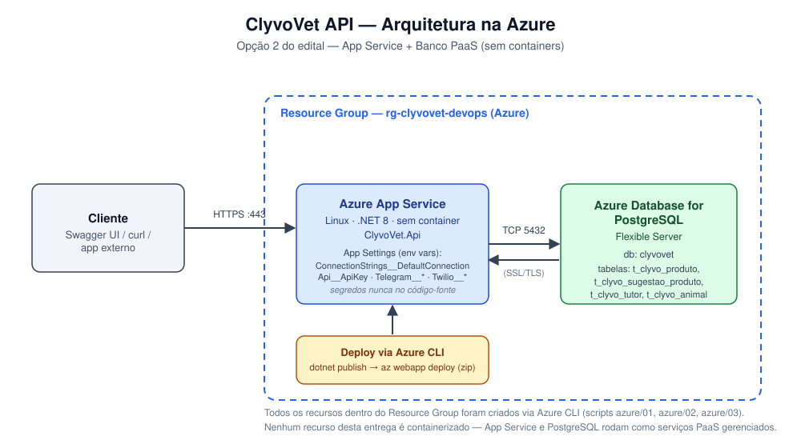

# ☁️ Sprint DevOps Tools & Cloud Computing — Deploy na Azure

> Movido do [README da raiz](../README.md) na Sprint 4, sem alteração de conteúdo: o README
> passou a tratar só da API, e este registro da entrega de DevOps continua aqui.

> ### ⚠️ Registro da entrega anterior — o procedimento vigente é outro
>
> O passo a passo desta seção foi o da **entrega anterior**, com a infraestrutura
> daquele momento (região `chilecentral`, scripts `azure/01` a `azure/04` deste
> repositório, schema aplicado por `schema/script_bd.sql`). Ele fica registrado
> porque documenta o que o vídeo daquela entrega mostra.
>
> **Para provisionar a infraestrutura da Sprint 3, siga o README do repositório
> [`clyvovet-backend-java`](https://github.com/Clyvovet-Challenge/clyvovet-backend-java),
> não este.** Lá os scripts `azure/00` a `azure/09` sobem, numa região só, o
> Resource Group, o MySQL, o plano compartilhado e **as duas** APIs — esta
> inclusive. Este repositório não provisiona mais nada sozinho.
>
> **Um ponto não é preferência, é quebra:** na Sprint 3 o banco é criado **vazio**,
> e quem cria o schema é o **Flyway da API Java**, no primeiro boot dela. Aplicar
> `schema/script_bd.sql` antes disso deixa o banco com as tabelas mas sem a
> `flyway_schema_history` — e o Flyway recusa migrar um schema não vazio que ele
> não conhece, então a API Java simplesmente não sobe. Ver o passo 5 abaixo.

> Esta seção documenta a entrega da disciplina **DevOps Tools & Cloud Computing**: a mesma API (ClyvoVet .NET) apresentada no restante deste README, publicada aqui num **Azure App Service** e conectada a um **Azure Database for MySQL Flexible Server compartilhado com a API Java** do time (Tutor, Animal, Clínica etc.). O passo a passo abaixo reproduz fielmente o que foi feito no vídeo de entrega.

**🎥 Vídeo de apresentação:** [assista aqui](https://www.youtube.com/watch?v=WBNx3ZSore0)

**Integrantes:**

| Nome | RM |
|---|---|
| Fabrício Henrique Pereira | RM563237 |
| Henrique Sinkevicius Maran | RM562977 |
| Leonardo José Pereira | RM563065 |
| Miguel Henrique Oliveira Dias | RM565492 |
| Pedro Henrique de Oliveira | RM562312 |

### Descrição da Solução

Construída em ASP.NET Core 8, a ClyvoVet API cuida do catálogo de produtos/serviços veterinários e também das sugestões de produto feitas para cada animal — duas tabelas conectadas entre si (`t_clyvo_produto` ← `t_clyvo_sugestao_produto`), ambas com CRUD completo. Nesta entrega, ela roda num **Azure App Service** (Linux, sem container) e persiste os dados num **Azure Database for MySQL Flexible Server** — o mesmo banco usado pela API Java do time (Tutor, Animal, Clínica, Veterinário etc.) —, permitindo que o app Mobile do grupo consuma as duas APIs sobre a mesma base de dados.

### Benefícios para o Negócio

- **Catálogo centralizado**: preço, categoria e espécie indicada de cada produto/serviço da clínica passam a ficar num único lugar, substituindo planilhas soltas ou anotações em papel.
- **Sugestão de produto rastreável**: cada sugestão feita a um tutor guarda justificativa e data, dando à clínica um histórico de recomendações por animal (ex.: antipulgas sugerido, ração indicada).
- **Integração real entre os sistemas do time**: como .NET e Java apontam para o mesmo banco, um animal já cadastrado na API Java pode receber lembretes e sugestões de produto pela API .NET sem exigir um segundo cadastro.
- **Escalabilidade sem gerenciar servidor**: rodando em PaaS (App Service + banco gerenciado), a clínica dispensa infraestrutura própria — disponibilidade, backup e patch do banco ficam a cargo da Azure.

### Banco de Dados em Nuvem

- **Motor:** MySQL 8.0, via **Azure Database for MySQL Flexible Server** (nada de H2, nada de container).
- **DDL completo:** [`schema/script_bd.sql`](../schema/script_bd.sql) traz o schema inteiro (tabelas da API Java somadas às nossas), com colunas, chaves primárias/estrangeiras, comentários e uma carga inicial de dados relevante. **Na Sprint 3 ele é documentação, não ferramenta de provisionamento** — serve para ler e conferir o modelo; quem cria as tabelas no banco de nuvem é o Flyway da API Java. As tabelas `tutor`/`animal`/etc. reproduzem as migrations Flyway reais do repositório da API Java (`clyvovet-backend-java`); mudando o schema de lá, essa cópia precisa acompanhar.
- **Tabelas do CRUD (núcleo da solução, avaliado nesta entrega):** `t_clyvo_produto` e `t_clyvo_sugestao_produto`, ligadas por `produto_id`. Já `tutor` e `animal` são da API Java — entram aqui apenas via FK/JOIN, para leitura, e o .NET nunca escreve nelas.

### Arquitetura escolhida: Opção 2 — App Service + Banco PaaS

Nenhuma parte desta entrega roda em container — nem o app nem o banco: tudo é feito em serviços gerenciados da Azure, provisionados via **Azure CLI**:

| Recurso | Serviço Azure | Criado por |
|---|---|---|
| Grupo de recursos | Resource Group | `azure/01-criar-recursos.sh` |
| Banco de dados | Azure Database for MySQL Flexible Server | `azure/01-criar-recursos.sh` |
| Plano de aplicativo | App Service Plan (Linux, B1) | `azure/02-criar-app-service.sh` |
| Aplicativo web | App Service (.NET 8, runtime nativo, sem container) | `azure/02-criar-app-service.sh` |



> Documentação técnica complementar em [`docs/`](README.md) — incluindo a
> [auditoria de arquitetura](auditoria-de-arquitetura.md) de 06/09/2026, que
> registra por que o banco é compartilhado com a API Java e o que esta API ainda
> precisa corrigir.

### Pré-requisitos

| Ferramenta | Para que serve |
|---|---|
| [Azure CLI](https://learn.microsoft.com/cli/azure/install-azure-cli) | Criar todos os recursos (obrigatório pelo edital) |
| Conta ativa na Azure (`az login`) | Ter uma subscription onde criar os recursos |
| [.NET SDK 8](https://dotnet.microsoft.com/download/dotnet/8.0) | `dotnet publish` local antes do deploy |
| Cliente `mysql` (MySQL Shell ou `mysql-client`) | Aplicar `schema/script_bd.sql` no banco recém-criado |
| Git | Clonar o repositório |

### Passo a passo — do zero até a API rodando na Azure

**1. Clonar o repositório**

```bash
git clone https://github.com/Clyvovet-Challenge/ClyvoVet-api.git
cd ClyvoVet-api
git checkout devops-sprint3-azure
```

**2. Login na Azure**

```bash
az login
```

**3. Ajustar as variáveis (se necessário)**

Abra `azure/00-variaveis.sh` e confira/ajuste `SUBSCRIPTION`, os nomes de recursos (precisam ser únicos em toda a Azure) e a região (`LOCATION`). Nesta entrega usamos `chilecentral` — certas assinaturas acadêmicas bloqueiam outras regiões via Azure Policy (erro `RequestDisallowedByAzure`), e mesmo dentro das regiões liberadas o MySQL Flexible Server às vezes devolve `InternalServerError` (instabilidade pontual do serviço, não da conta — já vimos isso acontecer em `brazilsouth`, `eastus2`, `southcentralus` e `canadacentral`); nesse caso, tente outra região liberada na sua assinatura.

**4. Criar o Resource Group + banco MySQL**

```bash
export MYSQL_PASSWORD='DefinaUmaSenhaForte123!'
bash azure/01-criar-recursos.sh
```

O comando provisiona o Resource Group, o servidor MySQL Flexible Server e o banco `clyvovet`, além de liberar seu IP atual no firewall.

**5. Aplicar o schema no banco**

> ⚠️ **Este passo não vale para a Sprint 3.** Lá o banco nasce vazio e o schema é
> criado pelo Flyway da API Java. Rodar o comando abaixo contra o banco da Sprint 3
> impede a API Java de subir, pelo motivo explicado no início desta seção.

```bash
mysql -h <MYSQL_SERVER>.mysql.database.azure.com -u clyvovetadmin -p$MYSQL_PASSWORD --ssl-mode=REQUIRED clyvovet < schema/script_bd.sql
```

(o script `01` já imprime esse mesmo comando, com os valores corretos, ao final da execução)

**6. Criar o App Service e configurar os segredos**

```bash
export API_KEY='GereUmaChaveAleatoria'
export TELEGRAM_BOT_TOKEN='...' TELEGRAM_API_KEY='...' TELEGRAM_BOT_USERNAME='...'
# OCI Generative AI (saude preditiva). Opcional: sem estas variaveis a API
# responde pelo fallback deterministico.
export OCI_TENANCY_OCID='...' OCI_USER_OCID='...' OCI_FINGERPRINT='...'
export OCI_PRIVATE_KEY_PEM="$(cat ~/.oci/clyvovet_api_key.pem)"
export OCI_REGION='us-chicago-1' OCI_COMPARTMENT_OCID='...'
bash azure/02-criar-app-service.sh
```

Todos os segredos entram como **App Settings** do App Service; em nenhum momento ficam gravados no código-fonte.

**7. Publicar o app**

Todo script carrega `00-variaveis.sh`, e esse arquivo exige `MYSQL_PASSWORD` no ambiente mesmo quando o script não toca no banco — abrindo um terminal novo depois do passo 4, exporte a senha outra vez antes de rodar:

```bash
export MYSQL_PASSWORD='DefinaUmaSenhaForte123!'
bash azure/03-deploy.sh
```

O script executa `dotnet publish`, compacta o resultado em zip e publica com `az webapp deploy`, exibindo a URL da API ao terminar.

**8. Validar**

```bash
curl https://<APP_NAME>.azurewebsites.net/health
```

A resposta esperada traz `"status": "Healthy"` em cada verificação.

### Testando o CRUD

Acesse `https://<APP_NAME>.azurewebsites.net/swagger`, clique em **Authorize** e informe a `Api__ApiKey` configurada no passo 6.

| Operação | Endpoint | Tabela afetada |
|---|---|---|
| Consultar | `GET /api/v1/produtos` | `t_clyvo_produto` |
| Inserir | `POST /api/v1/produtos` | `t_clyvo_produto` |
| Atualizar | `PUT /api/v1/produtos/{id}` | `t_clyvo_produto` |
| Excluir | `DELETE /api/v1/produtos/{id}` | `t_clyvo_produto` |
| Consultar | `GET /api/v1/sugestoes-produto` | `t_clyvo_sugestao_produto` |
| Inserir | `POST /api/v1/sugestoes-produto` | `t_clyvo_sugestao_produto` |
| Atualizar | `PUT /api/v1/sugestoes-produto/{id}` | `t_clyvo_sugestao_produto` |
| Excluir | `DELETE /api/v1/sugestoes-produto/{id}` | `t_clyvo_sugestao_produto` |

Para confirmar cada operação direto no banco (como pedido no vídeo), abra um shell interativo via `mysql` (o mesmo comando do passo 5, tirando o `< schema/script_bd.sql`) e execute:

```sql
SELECT * FROM t_clyvo_produto ORDER BY criado_em DESC;
SELECT * FROM t_clyvo_sugestao_produto ORDER BY criado_em DESC;
```

### Removendo os recursos (depois da correção)

```bash
export MYSQL_PASSWORD='DefinaUmaSenhaForte123!'   # mesma observação do passo 7
bash azure/04-destruir-recursos.sh
```

O script remove o Resource Group inteiro, com tudo o que há dentro dele. **Atenção:** caso o banco já esteja de fato compartilhado com a API Java em produção, alinhe com o time antes de executar — ele apaga o banco de todo mundo, não só o nosso.

---

## 🌐 API em produção

A hospedagem da Sprint 3 é **Azure App Service**, provisionada pelos scripts do
repositório da API Java (`azure/05-webapp-dotnet.sh` e `azure/08-deploy-dotnet.sh`).
Os endereços que o deploy publica:

- **Base URL:** `https://app-clyvovet-dotnet-rm562312.azurewebsites.net`
- **Swagger:** `.../swagger`
- **Health Check:** `.../health`, `.../health/live`, `.../health/ready`

> **Os links viram clicáveis quando o deploy da Sprint 3 rodar** — enquanto isso,
> os endereços acima são o destino, não um serviço no ar.
>
> A instância anterior ficava no plano Free do **Render**, em
> `clyvovet-api.onrender.com`. Ela **não responde mais** (verificado: a conexão nem
> se estabelece), e por isso saiu daqui em vez de continuar anunciada como "no ar
> 24/7" — README que aponta para URL morta custa mais do que README sem URL.
